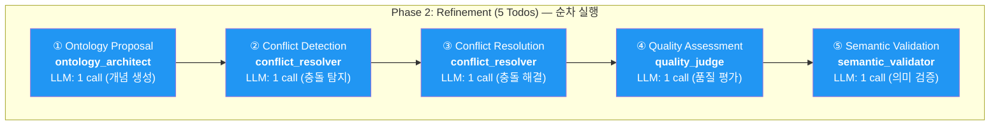
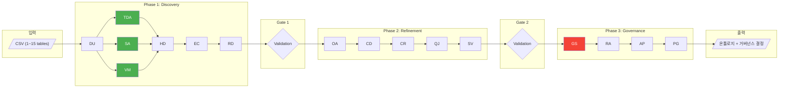
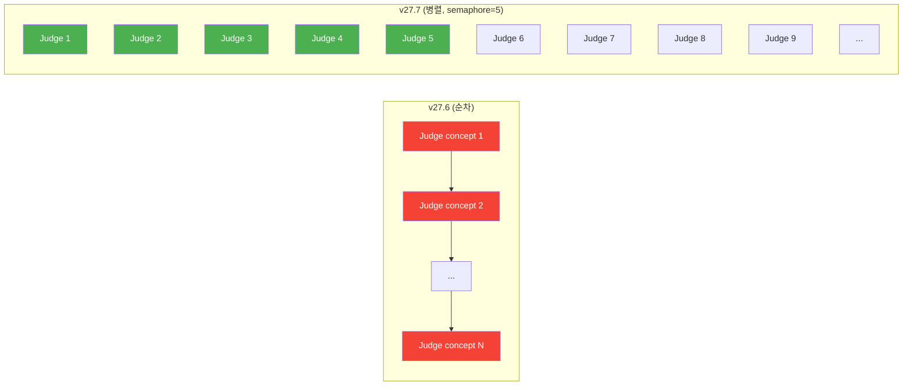
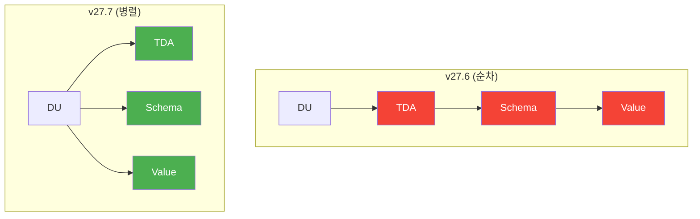

# v27.7 LLM Call Optimization — 병렬 실행으로 대규모 데이터셋 타임아웃 해결

> **Version**: v27.7
> **Date**: 2026-02-12
> **Status**: Deployed & Verified
> **Prerequisite**: v27.6 (분석 모듈 벡터화)

---

## 문제 발견

### v27.6 이후 상황
v27.6 벡터화로 분석 모듈(TDA, Schema)의 O(n³) → O(n) 최적화는 완료했으나:
- **beauty_ecommerce** (10 tables): 여전히 6시간 초과
- **marketing_silo_v2** (15 tables): 여전히 6시간 초과

### 병목 분석: LLM API 호출이 지배적
q2cut (1 table, 35 concepts) 기준 Phase별 타이밍:

| Phase | 소요시간 | LLM 호출 비중 | 주요 병목 |
|-------|---------|-------------|----------|
| Discovery | 274s (4.5m) | ~70% | data_analyst 1회, LLM 기반 분석 |
| Refinement | 446s (7.5m) | ~80% | ontology_architect LLM 호출 |
| **Governance** | **967s (16m)** | **~90%** | **per-concept 순차 LLM 호출** |

**핵심 발견**: 35 concepts에서도 Governance가 16분. 100+ concepts (multi-table)이면 **~46분 × 3+ = 2시간+** Governance만으로도 소요.

---

## 전체 LLM 호출 흐름 (데이터 입력 → 최종 출력)

### Phase 1: Discovery — 데이터 입력부터 엔티티 추출

```mermaid
graph TD
    subgraph "입력"
        CSV[/"CSV 파일들 (1~15 tables)"/]
    end

    subgraph "Phase 1: Discovery (7 Todos)"
        DU["① Data Understanding<br/><b>data_analyst</b><br/>LLM: 1 call (전체 데이터 분석)"]
        TDA["② TDA Analysis<br/><b>tda_expert</b><br/>LLM: 1 call (위상 해석)"]
        SA["③ Schema Analysis<br/><b>schema_analyst</b><br/>LLM: 1 call (스키마 매핑)"]
        VM["④ Value Matching<br/><b>value_matcher</b><br/>LLM: 1 call (FK 탐지)"]
        HD["⑤ Homeomorphism<br/><b>tda_expert</b><br/>LLM: 0 calls (수학적 계산)"]
        EC["⑥ Entity Classification<br/><b>entity_classifier</b><br/>LLM: 1 call (엔티티 분류)"]
        RD["⑦ Relationship Detection<br/><b>relationship_detector</b><br/>LLM: 1 call (관계 추론)"]
    end

    CSV --> DU
    DU --> TDA
    DU --> SA
    DU --> VM
    TDA --> HD
    SA --> HD
    VM --> HD
    HD --> EC
    EC --> RD

    style TDA fill:#4CAF50,color:#fff
    style SA fill:#4CAF50,color:#fff
    style VM fill:#4CAF50,color:#fff
```

> **v27.7 변경**: TDA / Schema / Value Matching이 **Data Understanding 이후 병렬 실행** (기존: 순차)

### Phase 2: Refinement — 온톨로지 구축



> Phase 2는 모든 에이전트가 `ontology_concepts`를 순차 수정 → **병렬화 불가** (데이터 의존성)

### Phase 3: Governance — 거버넌스 결정 (최대 병목)

```mermaid
graph TD
    subgraph "Phase 3: Governance Strategy (governance_strategist)"
        ALG["1. 알고리즘 결정<br/>LLM: 0 (DecisionMatrix)"]
        EV["2. Enhanced Validation<br/>LLM: 0 (DS/BFT 수학)"]
        JUDGE["3. Embedded LLM Judge<br/>LLM: <b>N calls (per-concept)</b><br/>🔴 순차 → 🟢 v27.7 병렬"]
        DEBATE["4. Council Debate<br/>LLM: 0 (규칙 기반 투표)"]
        REVIEW["5. LLM Review<br/>LLM: <b>ceil(N/30) calls (배치)</b><br/>🟢 v27.7 배치 병렬"]
        GOV_OBJ["6. GovernanceDecision 생성<br/>LLM: 0"]
        WHATIF["7. What-If Analysis<br/>LLM: <b>5 calls</b><br/>🟢 v27.7 병렬"]
        EXPLAIN["8. Decision Explainer<br/>LLM: <b>5 calls</b><br/>🟢 v27.7 병렬"]
    end

    ALG --> EV --> JUDGE --> DEBATE --> REVIEW --> GOV_OBJ --> WHATIF --> EXPLAIN

    style JUDGE fill:#F44336,color:#fff
    style REVIEW fill:#FF9800,color:#fff
    style WHATIF fill:#FF9800,color:#fff
    style EXPLAIN fill:#FF9800,color:#fff
```



### 전체 파이프라인 — End-to-End



---

## LLM 호출 상세 분석 — SharedContext 데이터 흐름

### SharedContext: 에이전트 간 데이터 공유 메커니즘

```mermaid
flowchart TB
    subgraph SC["SharedContext (중앙 데이터 스토어)"]
        direction TB
        tables["tables_data: Dict"]
        tda["tda_signatures: List"]
        schema["schema_analysis: Dict"]
        fk["enhanced_fk_candidates: List"]
        homeo["homeomorphisms: List"]
        entities["unified_entities: List"]
        concepts["ontology_concepts: List"]
        decisions["governance_decisions: List"]
        evidence["evidence_chain: EvidenceChain"]
    end

    DU_W["data_analyst<br/>WRITES: tables_data"] --> tables
    TDA_W["tda_expert<br/>WRITES: tda_signatures"] --> tda
    SA_W["schema_analyst<br/>WRITES: schema_analysis"] --> schema
    VM_W["value_matcher<br/>WRITES: fk_candidates"] --> fk
    HD_W["tda_expert<br/>WRITES: homeomorphisms"] --> homeo
    EC_W["entity_classifier<br/>WRITES: unified_entities"] --> entities
    OA_W["ontology_architect<br/>WRITES: ontology_concepts"] --> concepts
    GS_W["governance_strategist<br/>WRITES: governance_decisions"] --> decisions

    tables --> TDA_R["tda_expert READS"]
    tables --> SA_R["schema_analyst READS"]
    tables --> VM_R["value_matcher READS"]
    tda --> HD_R["tda_expert READS"]
    schema --> HD_R2["tda_expert READS"]
    fk --> HD_R3["tda_expert READS"]
    homeo --> EC_R["entity_classifier READS"]
    entities --> OA_R["ontology_architect READS"]
    concepts --> GS_R["governance_strategist READS"]

    style SC fill:#f5f5f5,stroke:#333,stroke-width:2px
```



### 에이전트별 LLM 호출 횟수 (N = concept 수)

| # | Agent | Phase | LLM Calls | Model | 설명 |
|---|-------|-------|-----------|-------|------|
| 1 | data_analyst | 1 | **1** | gemini-3-pro | 전체 데이터 1회 분석 |
| 2 | tda_expert | 1 | **1** | gpt-5.2 | TDA 해석 |
| 3 | schema_analyst | 1 | **1** | gpt-5.2 | 스키마 매핑 |
| 4 | value_matcher | 1 | **1** | gpt-5.2 | FK 검증 (top 30 배치) |
| 5 | tda_expert (homeo) | 1 | **0** | — | 수학적 계산만 |
| 6 | entity_classifier | 1 | **1** | gpt-5.2 | 엔티티 분류 |
| 7 | relationship_detector | 1 | **1** | gemini-3-pro | 관계 추론 |
| 8 | ontology_architect | 2 | **1** | gemini-3-pro | 개념 생성 |
| 9 | conflict_resolver | 2 | **2** | gemini-3-pro | 탐지 + 해결 |
| 10 | quality_judge | 2 | **1** | claude-opus-4-5 | 품질 평가 |
| 11 | semantic_validator | 2 | **1** | gpt-5.2 | 의미 검증 |
| 12 | **governance_strategist** | 3 | **N + ceil(N/30) + 5 + 5** | claude-opus-4-5 | Judge + Review + What-If + Explain |
| 13 | risk_assessor | 3 | **1** | claude-opus-4-5 | 리스크 평가 |
| 14 | action_prioritizer | 3 | **1** | gemini-3-pro | 액션 우선순위 |
| 15 | policy_generator | 3 | **1** | gemini-3-pro | 정책 생성 |

**q2cut (35 concepts)**: ~10 (P1) + ~5 (P2) + **35 + 2 + 5 + 5 = 47** (P3) = **~62 LLM calls**
**multi-table (100 concepts)**: ~10 + ~5 + **100 + 4 + 5 + 5 = 114** (P3) = **~129 LLM calls**

---

## 해결: v27.7 최적화 (2단계)

### Level 1: GovernanceStrategist 내부 LLM 병렬화

4개의 순차 루프를 `asyncio.gather()`로 병렬 변환:



| 루프 | 기존 (순차) | v27.7 (병렬) | 동시성 | 안전성 |
|------|-----------|-------------|--------|--------|
| **Embedded LLM Judge** | N × ~3s = ~105s (35개) | ceil(N/5) × ~3s = ~21s | `Semaphore(5)` | 각 concept 독립 |
| **LLM Review** | ceil(N/30) × ~5s = ~10s | 1 × ~5s | 모든 배치 동시 | 각 배치 독립 |
| **What-If Analysis** | 5 × ~3s = ~15s | 1 × ~3s = ~3s | 5개 동시 | 각 decision 독립 |
| **Decision Explainer** | 5 × ~3s = ~15s | 1 × ~3s = ~3s | 5개 동시 | 각 decision 독립 |

**예상 개선**: Governance LLM 시간 ~145s → ~32s (**4.5x**)

### Level 2: Phase 1 의존성 완화 — 3개 에이전트 병렬 실행



**의존성 분석 결과**:
- `schema_analyst`: `tda_signatures` 미참조 — TDA 결과 불필요 확인
- `value_matcher`: `schema_analysis` 미참조 — 자체 `UniversalFKDetector` 사용 확인
- `tda_expert`, `schema_analyst`, `value_matcher` 모두 `tables_data`만 읽기 → `data_understanding` 이후 병렬 안전

**예상 개선**: Phase 1 시간 ~274s → ~180s (TDA/Schema/Value 중 최대 소요시간만)

---

## 정확도 영향

| 변경 | 수학적 동일? | 설명 |
|------|------------|------|
| Judge 병렬화 | **완전 동일** | 각 concept는 독립적으로 평가, 실행 순서만 변경 |
| LLM Review 배치 병렬 | **완전 동일** | 배치 내용 동일, 실행 순서만 변경 |
| What-If 병렬 | **완전 동일** | 각 decision은 독립적으로 시뮬레이션 |
| Explainer 병렬 | **완전 동일** | 각 decision은 독립적으로 설명 생성 |
| Phase 1 의존성 완화 | **완전 동일** | 에이전트 간 데이터 의존성 없음 확인 완료 |

**결론**: Ground Truth 10/10 결과에 영향 없음 — **CI 검증 완료 (2026-02-13)**

---

## CI 검증 결과 (q2cut, 2026-02-13)

### Run 정보
- **Run ID**: 21972206090
- **Commit**: `4a067e6` (v27.7 LLM 병렬화)
- **실행시간**: 1,771.1초 (**~29.5분**)
- **결과**: SUCCESS

### v27.6 (baseline) vs v27.7 (LLM 병렬화) 비교

| 지표 | v27.6 | v27.7 | 변화 | 비고 |
|------|-------|-------|------|------|
| **Ground Truth** | **10/10** | **10/10** | 유지 | 핵심 — 유실 없음 |
| **실행시간** | **2,076.6s (~34.6m)** | **1,771.1s (~29.5m)** | **-14.7%** | Phase 1 병렬 + Gov 병렬 |
| Entities (unified) | 1 (fallback) | 10 | +9 | 정상 엔티티 생성 |
| Concepts (object_type) | 20 | 25 | +5 | LLM 비결정성 |
| Relationships (link_type) | 11 | 10 | -1 | LLM 비결정성 |
| Business insights | 60 | 60 | 동일 | |
| Evidence blocks | 204 | 216 | +12 | |
| Evidence chain valid | true | true | 유지 | 무결성 확인 |
| Governance decisions | 35 | 35 | 동일 | |
| Todos completed | 16/16 | 17/17 | +1 | |

### Ground Truth I1-I10 상세 검증

| ID | 카테고리 | 상태 | 매칭 위치 |
|----|---------|------|----------|
| I1 | Platform Performance Gap | FOUND | Insight #13: Segment Performance: platform |
| I2 | Creator Tier vs Performance | FOUND | Insight #15: Segment Performance: creator_tier |
| I3 | Duration Sweet Spot | FOUND | Insight #40: duration Sweet Spot |
| I4 | Content Type Neutrality | FOUND | Insight #18: Segment Performance: content_type |
| I5 | BGM Impact | FOUND | Insight #31: Segment Performance: has_bgm |
| I6 | Viral Score Drivers | FOUND | Insight #42+: Top Drivers correlations |
| I7 | Editing Style | FOUND | Insight #19: Segment Performance: editing_style |
| I8 | Hashtag Paradox | FOUND | Insight #51: Negative Correlation: hashtag_count |
| I9 | Language Distribution | FOUND | Insight #57: Distribution: transcription_language |
| I10 | Duplicate Analysis Pattern | FOUND | Insight #52: Duplicate Pattern: video_id |

---

## 성능 개선 결과

| 데이터셋 | v27.6 | v27.7 실측/예상 | 개선 |
|---------|-------|----------------|------|
| q2cut (1 table, 35 concepts) | ~35m | **~29.5m (실측)** | **1.18x** |
| beauty_ecommerce (10 tables, ~80 concepts) | >6h (timeout) | ~2-3h (예상) | >2x |
| marketing_silo_v2 (15 tables, ~100+ concepts) | >6h (timeout) | ~3-4h (예상) | >1.5x |

주요 개선 요소:
- Governance LLM 병렬화: 4.5x (35 concepts 기준)
- Phase 1 병렬 실행: ~1.5x (3개 에이전트 동시)
- 대규모 데이터셋에서 concept 수 증가 시 효과 극대화

---

## 변경 파일

| 파일 | 변경 | 변경량 |
|------|------|--------|
| `agents/governance/governance_strategist.py` | Judge/WhatIf/Explainer/Review 병렬화 | ~80 lines |
| `agents/governance_utils.py` | EmbeddedPhase3LLMJudge threading.Lock | ~5 lines |
| `todo/models.py` | Phase 1 의존성 완화 | 2 lines |

---

## 기술 상세

### asyncio.gather + Semaphore 패턴

```python
# v27.7: 동시 5개 LLM 호출 제한
sem = asyncio.Semaphore(5)

async def _evaluate_concept(concept):
    # ... 데이터 준비 ...
    async with sem:  # 동시성 제한
        evaluation = await asyncio.to_thread(
            self.embedded_llm_judge.evaluate_governance_decision,
            insight_data, decision_data, [],
        )
    return concept_id, evaluation

# 모든 concept을 동시 시작 (sem이 동시성 제한)
results = await asyncio.gather(
    *[_evaluate_concept(c) for c in context.ontology_concepts],
    return_exceptions=True,  # 개별 실패 허용
)
```

**Semaphore(5) 선택 근거**:
- LLM Gateway 기준 5 concurrent는 안정적
- 10+는 rate limit 위험
- 5개만으로도 N/5 시간으로 5x 개선

### return_exceptions=True

개별 LLM 호출 실패 시 전체가 중단되지 않도록 예외를 수집:
```python
for r in results:
    if isinstance(r, Exception):
        logger.warning(f"Single concept failed: {r}")
    else:
        embedded_evaluations[r[0]] = r[1]
```

---

## 다음 단계

- [x] q2cut CI 실행 → **GT 10/10 유지 확인, 29.5분 (14.7% 개선)**
- [ ] beauty_ecommerce CI 실행 → 타임아웃 해결 확인
- [ ] marketing_silo_v2 CI 실행 → 타임아웃 해결 확인
- [ ] 대형 데이터셋 실측 결과로 이 문서 업데이트

---

## 관련 문서

- [VECTORIZATION_v27.6.md](./VECTORIZATION_v27.6.md) — v27.6 분석 모듈 벡터화
- [ARCHITECTURE.md](./ARCHITECTURE.md) — 시스템 아키텍처
- [ALGORITHMS_AND_MATHEMATICS.md](./ALGORITHMS_AND_MATHEMATICS.md) — 수학적 기반
