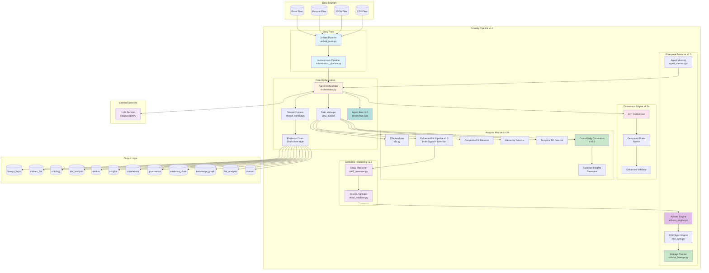
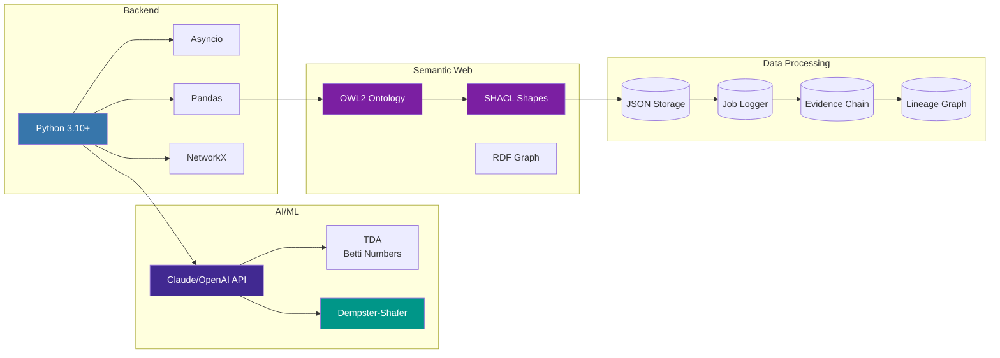
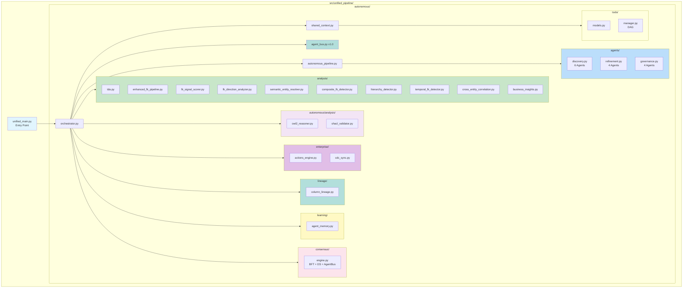
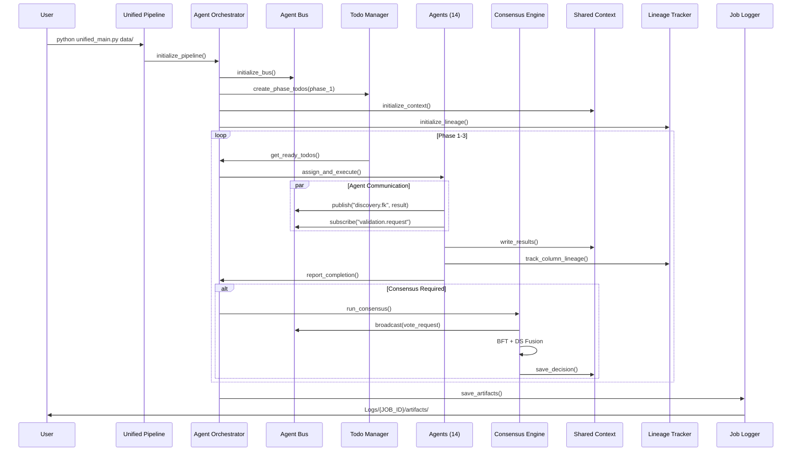
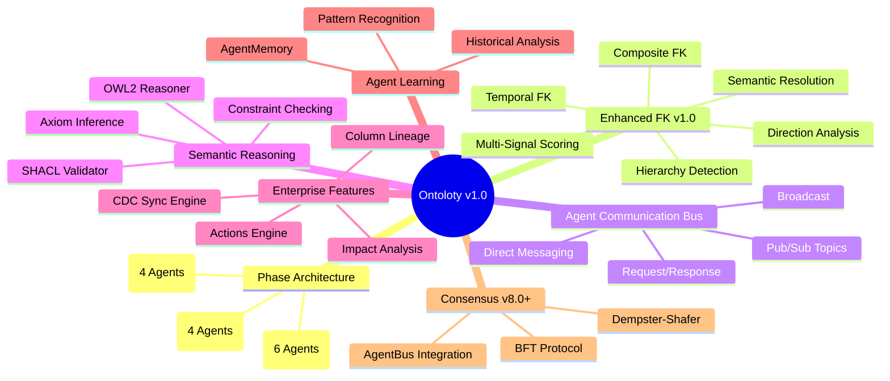
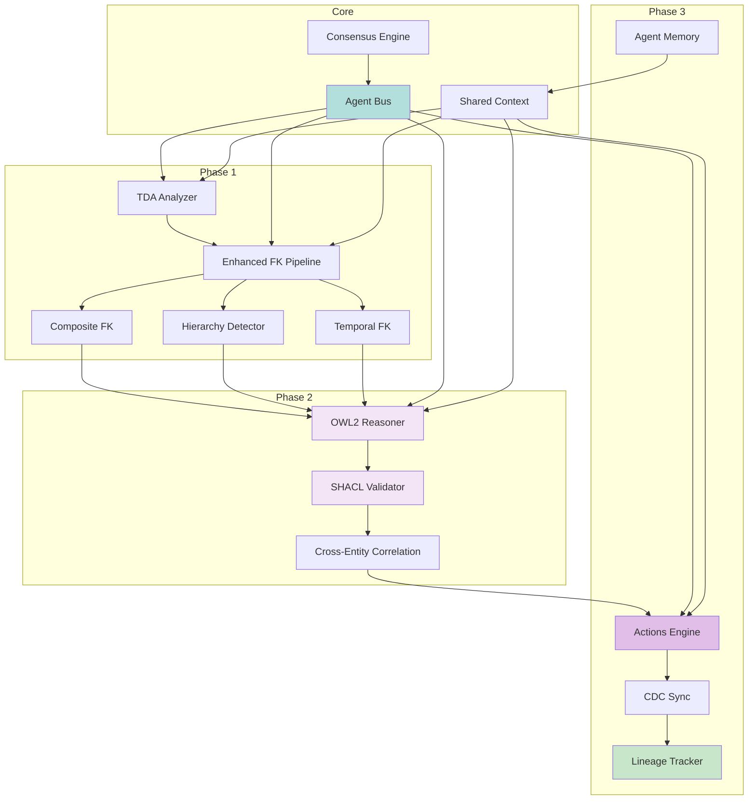

# 시스템 아키텍처 다이어그램

> **버전**: v1.0
> **최종 업데이트**: 2026-01-27

## 1. 전체 시스템 개요



## 2. 3단계 파이프라인 구조 (v1.0)

```mermaid
graph LR
    subgraph Phase1["Phase 1: Discovery"]
        P1A[Data Analyst]
        P1B[TDA Expert]
        P1C[Schema Analyst]
        P1D[Value Matcher]
        P1E[Entity Classifier]
        P1F[Relationship Detector<br/>v1.0 Enhanced]
    end

    subgraph Phase2["Phase 2: Refinement"]
        P2A[Ontology Architect<br/>+ OWL2 Reasoner]
        P2B[Conflict Resolver]
        P2C[Quality Judge<br/>+ SHACL Validator]
        P2D[Semantic Validator]
    end

    subgraph Phase3["Phase 3: Governance"]
        P3A[Governance Strategist<br/>+ Actions Engine]
        P3B[Action Prioritizer]
        P3C[Risk Assessor<br/>+ Impact Analysis]
        P3D[Policy Generator<br/>+ CDC Sync]
    end

    Phase1 --> Phase2 --> Phase3

    style Phase1 fill:#bbdefb
    style Phase2 fill:#fff9c4
    style Phase3 fill:#e1bee7
```



## 3. v1.0 모듈 아키텍처

```mermaid
graph TB
    subgraph "Enhanced FK Detection v1.0"
        direction TB
        EFP[Enhanced FK Pipeline]
        MSS[Multi-Signal Scorer<br/>5 Signals]
        FDA[Direction Analyzer<br/>5 Evidence Types]
        SER[Semantic Entity Resolver]

        subgraph "Advanced Detectors"
            CFK[Composite FK<br/>Multi-column Keys]
            HFD[Hierarchy Detector<br/>Self-referencing]
            TFK[Temporal FK<br/>Time-based Relations]
        end

        EFP --> MSS --> FDA --> SER
        SER --> CFK & HFD & TFK
    end

    subgraph "Semantic Reasoning v1.0"
        direction TB
        OWL[OWL2 Reasoner]

        subgraph "OWL2 Axioms"
            SUB[SubClassOf]
            EQV[EquivalentClass]
            DIS[DisjointClasses]
            DOM[PropertyDomain/Range]
        end

        SHACL[SHACL Validator]

        subgraph "SHACL Constraints"
            SHP[NodeShape]
            DT[Datatype Constraints]
            CARD[Cardinality]
            PAT[Pattern Matching]
        end

        OWL --> SUB & EQV & DIS & DOM
        SHACL --> SHP & DT & CARD & PAT
    end

    subgraph "Enterprise Features v1.0"
        direction TB
        ACT[Actions Engine]

        subgraph "Action Types"
            DA[DataAction]
            GA[GovernanceAction]
            QA[QualityAction]
        end

        CDC[CDC Sync Engine]

        subgraph "Sync Modes"
            FULL[Full Sync]
            INC[Incremental]
            STR[Streaming]
        end

        LIN[Lineage Tracker]

        subgraph "Lineage Types"
            COL[Column Lineage]
            TRF[Transformations]
            IMP[Impact Analysis]
        end

        ACT --> DA & GA & QA
        CDC --> FULL & INC & STR
        LIN --> COL & TRF & IMP
    end

    style EFP fill:#c8e6c9
    style OWL fill:#f3e5f5
    style SHACL fill:#f3e5f5
    style ACT fill:#e1bee7
    style CDC fill:#ffccbc
    style LIN fill:#b2dfdb
```



## 4. Agent Communication Bus (v1.0)

```mermaid
graph TB
    subgraph "Agent Communication Bus"
        direction TB
        BUS[AgentCommunicationBus<br/>Singleton]

        subgraph "Communication Patterns"
            DM[Direct Messaging<br/>send_to(agent_id, msg)]
            BC[Broadcast<br/>broadcast(msg)]
            RR[Request/Response<br/>request(agent_id, msg)]
            PS[Pub/Sub<br/>subscribe/publish(topic)]
        end

        subgraph "Message Types"
            INFO[INFO - 정보 공유]
            DISC[DISCOVERY - 발견 결과]
            REQ[REQUEST - 분석 요청]
            VAL[VALIDATION - 검증 요청]
            COL[COLLABORATION - 협업]
        end

        subgraph "Priority Levels"
            LOW[LOW - 0]
            NORMAL[NORMAL - 1]
            HIGH[HIGH - 2]
            URGENT[URGENT - 3]
        end

        BUS --> DM & BC & RR & PS
        DM & BC & RR & PS --> INFO & DISC & REQ & VAL & COL
    end

    subgraph "Agent Subscribers"
        A1[Discovery Agents<br/>6 agents]
        A2[Refinement Agents<br/>4 agents]
        A3[Governance Agents<br/>4 agents]
    end

    BUS --> A1 & A2 & A3

    style BUS fill:#b2dfdb
    style DM fill:#e3f2fd
    style PS fill:#fff9c4
```

## 5. 기술 스택 (v1.0)



## 6. 디렉토리 구조 (v1.0)



## 7. 핵심 컴포넌트 상호작용 (v1.0)



## 8. v1.0 주요 특징



## 9. 모듈 의존성 그래프


