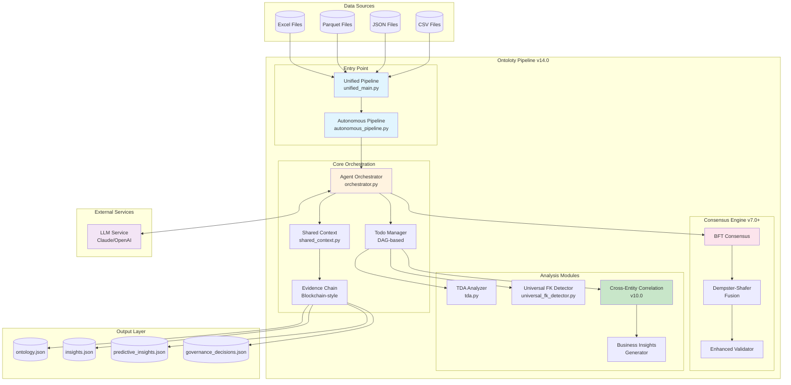
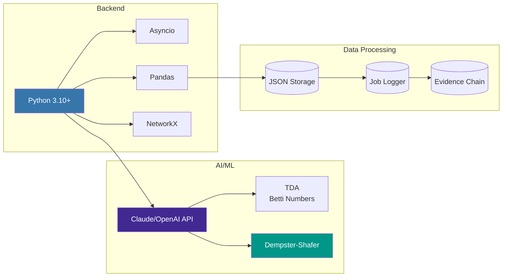
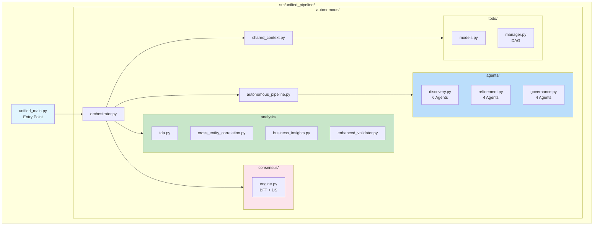
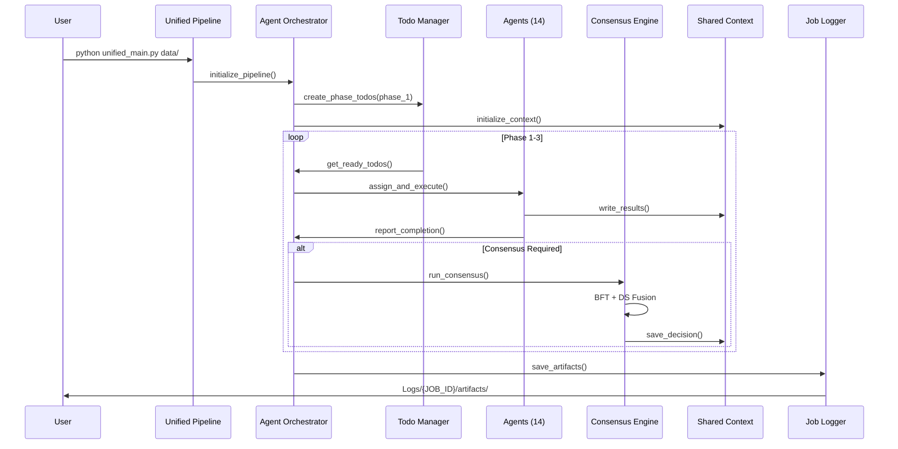
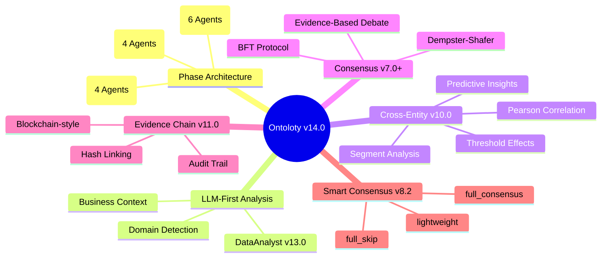

# 시스템 아키텍처 다이어그램

> **버전**: v14.0
> **최종 업데이트**: 2026-01-19

## 1. 전체 시스템 개요

```mermaid
graph TB
    subgraph "Data Sources"
        DS1[(CSV Files)]
        DS2[(JSON Files)]
        DS3[(Parquet Files)]
        DS4[(Excel Files)]
    end

    subgraph "Ontoloty Pipeline v14.0"
        subgraph "Entry Point"
            UP[Unified Pipeline<br/>unified_main.py]
            AP[Autonomous Pipeline<br/>autonomous_pipeline.py]
        end

        subgraph "Core Orchestration"
            AO[Agent Orchestrator<br/>orchestrator.py]
            TM[Todo Manager<br/>DAG-based]
            SC[Shared Context<br/>shared_context.py]
            EC[Evidence Chain<br/>Blockchain-style]
        end

        subgraph "Consensus Engine v7.0+"
            CE[BFT Consensus]
            DS[Dempster-Shafer<br/>Fusion]
            EV[Enhanced Validator]
        end

        subgraph "Analysis Modules"
            TDA[TDA Analyzer<br/>tda.py]
            FK[Universal FK Detector<br/>universal_fk_detector.py]
            CEC[Cross-Entity Correlation<br/>v10.0]
            BI[Business Insights<br/>Generator]
        end
    end

    subgraph "Output Layer"
        ONT[(ontology.json)]
        INS[(insights.json)]
        PI[(predictive_insights.json)]
        GOV[(governance_decisions.json)]
    end

    subgraph "External Services"
        LLM[LLM Service<br/>Claude/OpenAI]
    end

    DS1 & DS2 & DS3 & DS4 --> UP
    UP --> AP
    AP --> AO
    AO --> TM
    AO --> SC
    AO --> CE
    TM --> TDA & FK & CEC
    CEC --> BI
    CE --> DS --> EV
    AO <--> LLM
    SC --> EC
    EC --> ONT & INS & PI & GOV

    style UP fill:#e1f5fe
    style AP fill:#e1f5fe
    style AO fill:#fff3e0
    style CE fill:#fce4ec
    style CEC fill:#c8e6c9
    style LLM fill:#f3e5f5
```

## 2. 3단계 파이프라인 구조

```mermaid
graph LR
    subgraph Phase1["Phase 1: Discovery"]
        P1A[Data Analyst<br/>v13.0 LLM-First]
        P1B[TDA Expert]
        P1C[Schema Analyst]
        P1D[Value Matcher]
        P1E[Entity Classifier]
        P1F[Relationship Detector]
    end

    subgraph Phase2["Phase 2: Refinement"]
        P2A[Ontology Architect<br/>+ Cross-Entity]
        P2B[Conflict Resolver]
        P2C[Quality Judge]
        P2D[Semantic Validator]
    end

    subgraph Phase3["Phase 3: Governance"]
        P3A[Governance Strategist]
        P3B[Action Prioritizer]
        P3C[Risk Assessor]
        P3D[Policy Generator]
    end

    Phase1 --> Phase2 --> Phase3

    style Phase1 fill:#bbdefb
    style Phase2 fill:#fff9c4
    style Phase3 fill:#e1bee7
```

## 3. 기술 스택

```mermaid
graph LR
    subgraph "Backend"
        PY[Python 3.10+]
        ASYNC[Asyncio]
        PD[Pandas]
        NX[NetworkX]
    end

    subgraph "AI/ML"
        LLM[Claude/OpenAI API]
        TDA[TDA<br/>Betti Numbers]
        DS[Dempster-Shafer]
    end

    subgraph "Data Processing"
        JSON[(JSON Storage)]
        LOG[(Job Logger)]
        EC[(Evidence Chain)]
    end

    PY --> ASYNC
    PY --> PD & NX
    PY --> LLM
    LLM --> TDA & DS
    PD --> JSON
    JSON --> LOG
    LOG --> EC

    style PY fill:#3776ab,color:#fff
    style LLM fill:#412991,color:#fff
    style DS fill:#009688,color:#fff
```

## 4. 디렉토리 구조

```mermaid
graph TB
    subgraph ROOT["src/unified_pipeline/"]
        MAIN[unified_main.py<br/>Entry Point]

        subgraph AUTO["autonomous/"]
            ORCH[orchestrator.py]
            PIPE[autonomous_pipeline.py]
            CTX[shared_context.py]

            subgraph AGENTS["agents/"]
                DISC[discovery.py<br/>6 Agents]
                REF[refinement.py<br/>4 Agents]
                GOV[governance.py<br/>4 Agents]
            end

            subgraph ANALYSIS["analysis/"]
                TDA_M[tda.py]
                CEC_M[cross_entity_correlation.py]
                BI_M[business_insights.py]
                VAL_M[enhanced_validator.py]
            end

            subgraph CONSENSUS["consensus/"]
                ENG[engine.py<br/>BFT + DS]
            end

            subgraph TODO["todo/"]
                MOD[models.py]
                MGR[manager.py<br/>DAG]
            end
        end
    end

    MAIN --> ORCH
    ORCH --> PIPE
    PIPE --> AGENTS
    ORCH --> ANALYSIS
    ORCH --> CONSENSUS
    ORCH --> CTX
    CTX --> TODO

    style MAIN fill:#e1f5fe
    style AGENTS fill:#bbdefb
    style ANALYSIS fill:#c8e6c9
    style CONSENSUS fill:#fce4ec
```

## 5. 핵심 컴포넌트 상호작용

```mermaid
sequenceDiagram
    participant U as User
    participant UP as Unified Pipeline
    participant AO as Agent Orchestrator
    participant TM as Todo Manager
    participant AG as Agents (14)
    participant CE as Consensus Engine
    participant SC as Shared Context
    participant JL as Job Logger

    U->>UP: python unified_main.py data/
    UP->>AO: initialize_pipeline()
    AO->>TM: create_phase_todos(phase_1)
    AO->>SC: initialize_context()

    loop Phase 1-3
        TM->>AO: get_ready_todos()
        AO->>AG: assign_and_execute()
        AG->>SC: write_results()
        AG->>AO: report_completion()

        alt Consensus Required
            AO->>CE: run_consensus()
            CE->>CE: BFT + DS Fusion
            CE->>SC: save_decision()
        end
    end

    AO->>JL: save_artifacts()
    JL->>U: Logs/{JOB_ID}/artifacts/
```

## 6. v14.0 주요 특징

```mermaid
mindmap
    root((Ontoloty v14.0))
        Phase Architecture
            Discovery (6 Agents)
            Refinement (4 Agents)
            Governance (4 Agents)
        LLM-First Analysis
            DataAnalyst v13.0
            Domain Detection
            Business Context
        Cross-Entity v10.0
            Pearson Correlation
            Threshold Effects
            Segment Analysis
            Predictive Insights
        Consensus v7.0+
            BFT Protocol
            Dempster-Shafer
            Evidence-Based Debate
        Evidence Chain v11.0
            Blockchain-style
            Hash Linking
            Audit Trail
        Smart Consensus v8.2
            full_skip
            lightweight
            full_consensus
```
