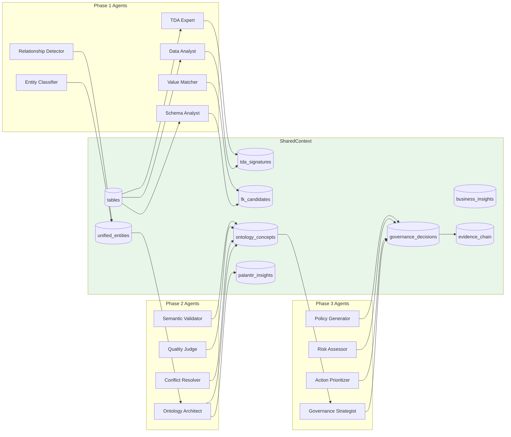
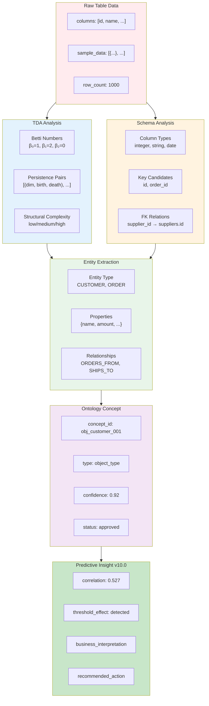
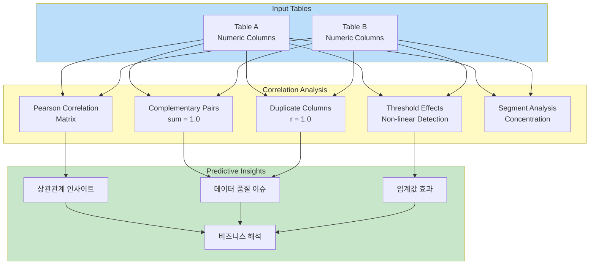
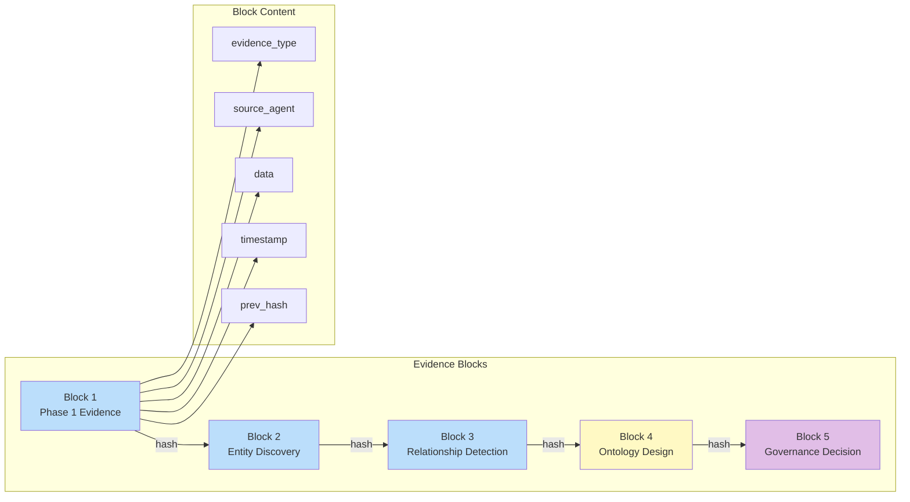
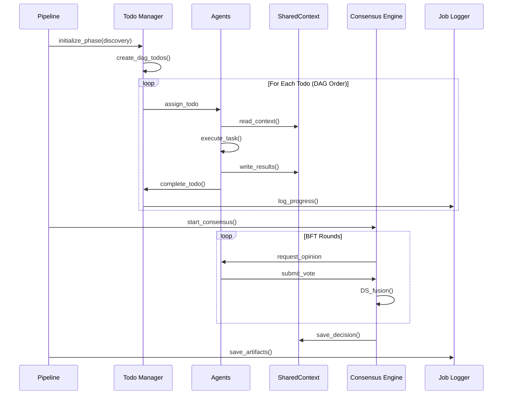
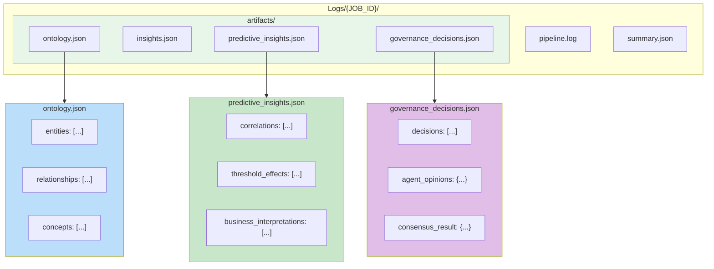

# 데이터 흐름 다이어그램

> **버전**: v14.0
> **최종 업데이트**: 2026-01-19

## 1. 전체 데이터 흐름

```mermaid
flowchart TB
    subgraph INPUT["Input Layer"]
        direction LR
        T1[Table 1<br/>CSV/JSON]
        T2[Table 2<br/>CSV/JSON]
        T3[Table 3<br/>CSV/JSON]
        TN[Table N<br/>...]
    end

    subgraph PHASE1["Phase 1: Discovery"]
        direction TB
        P1A[Data Analyst<br/>LLM-First v13.0]
        P1B[TDA Signature<br/>Computation]
        P1C[Schema Analysis<br/>+ FK Detection]
        P1D[Entity<br/>Classification]
        P1E[Relationship<br/>Detection]

        P1A --> P1B
        P1A --> P1C
        P1B --> P1D
        P1C --> P1D
        P1D --> P1E
    end

    subgraph PHASE2["Phase 2: Refinement"]
        direction TB
        P2A[Ontology<br/>Architecture]
        P2B[Cross-Entity<br/>Correlation v10.0]
        P2C[Quality<br/>Assessment]
        P2D[Conflict<br/>Resolution]
        P2E[Smart Consensus<br/>v8.2]

        P2A --> P2B
        P2B --> P2C
        P2C --> P2D
        P2D --> P2E
    end

    subgraph PHASE3["Phase 3: Governance"]
        direction TB
        P3A[Agent Council<br/>4 Personas]
        P3B[BFT Consensus<br/>+ DS Fusion]
        P3C[Evidence-Based<br/>Debate]
        P3D[Final<br/>Decision]

        P3A --> P3B
        P3B --> P3C
        P3C --> P3D
    end

    subgraph OUTPUT["Output Layer"]
        direction LR
        O1[ontology.json]
        O2[insights.json]
        O3[predictive_insights.json]
        O4[governance_decisions.json]
    end

    INPUT --> PHASE1
    PHASE1 --> PHASE2
    PHASE2 --> PHASE3
    PHASE3 --> OUTPUT

    style PHASE1 fill:#bbdefb
    style PHASE2 fill:#fff9c4
    style PHASE3 fill:#e1bee7
```

## 2. SharedContext 데이터 흐름

## 3. 데이터 변환 파이프라인

## 4. Cross-Entity Correlation 데이터 흐름 (v10.0)

## 5. Evidence Chain 데이터 흐름 (v11.0)

## 6. 이벤트 스트림 흐름

## 7. 아티팩트 출력 구조

