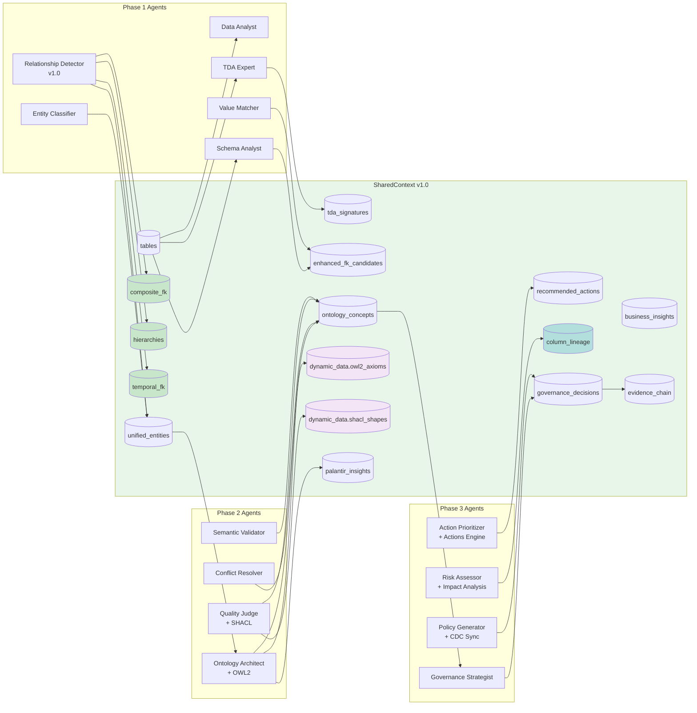

# 데이터 흐름 다이어그램

> **버전**: v1.0
> **최종 업데이트**: 2026-01-27

## 1. 전체 데이터 흐름


## 2. SharedContext 데이터 흐름 (v1.0)



## 3. 데이터 변환 파이프라인 (v1.0)


## 4. Enhanced FK Detection 데이터 흐름 (v1.0)


## 5. OWL2 Reasoning 데이터 흐름 (v1.0)


## 6. SHACL Validation 데이터 흐름 (v1.0)


## 7. Column Lineage 데이터 흐름 (v1.0)

```mermaid
flowchart TB
    subgraph INPUT["Source Data"]
        S1[(Table A<br/>col_1, col_2)]
        S2[(Table B<br/>col_3, col_4)]
    end

    subgraph TRANSFORM["Transformations"]
        T1[JOIN<br/>A.col_1 = B.col_3]
        T2[AGGREGATE<br/>SUM(col_2)]
        T3[FILTER<br/>col_4 > 100]
    end

    subgraph LINEAGE["Lineage Graph"]
        subgraph NODES["Column Nodes"]
            CN1[A.col_1<br/>SOURCE]
            CN2[A.col_2<br/>SOURCE]
            CN3[B.col_3<br/>SOURCE]
            CN4[B.col_4<br/>SOURCE]
            CN5[joined.col_1<br/>DERIVED]
            CN6[result.total<br/>AGGREGATE]
        end

        subgraph EDGES["Lineage Edges"]
            E1[DIRECT<br/>Identity mapping]
            E2[AGGREGATED<br/>Aggregation]
            E3[FILTERED<br/>Subset]
            E4[DERIVED<br/>Calculation]
        end
    end

    subgraph OUTPUT["Impact Analysis"]
        O1["Upstream Impact<br/>What affects this?"]
        O2["Downstream Impact<br/>What does this affect?"]
        O3["Change Propagation<br/>Affected columns"]
    end

    S1 --> T1
    S2 --> T1
    T1 --> T2 --> T3

    CN1 & CN3 --> CN5
    CN2 --> CN6

    LINEAGE --> OUTPUT

    style LINEAGE fill:#b2dfdb
    style NODES fill:#c8e6c9
    style OUTPUT fill:#fff9c4
```

## 8. Agent Communication Bus 데이터 흐름 (v1.0)


## 9. CDC Sync 데이터 흐름 (v1.0)


## 10. Actions Engine 데이터 흐름 (v1.0)


## 11. 아티팩트 출력 구조 (v1.0)


