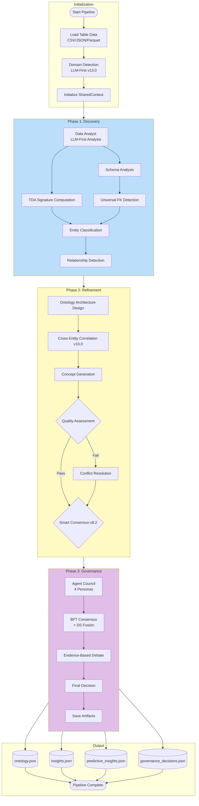
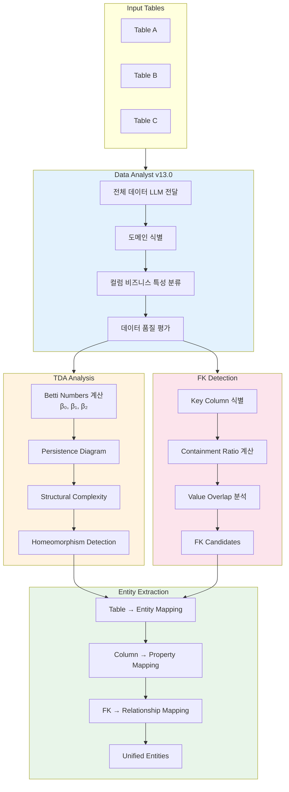
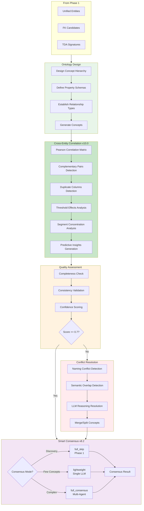
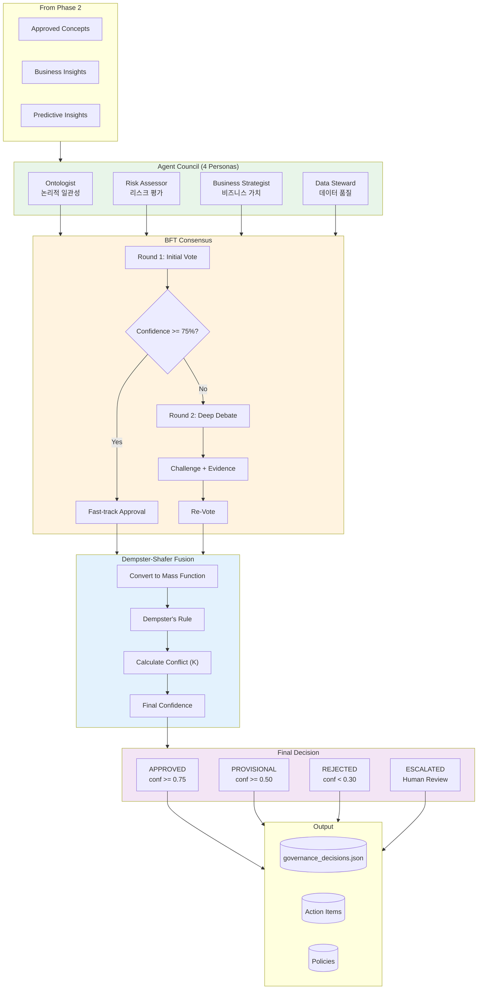
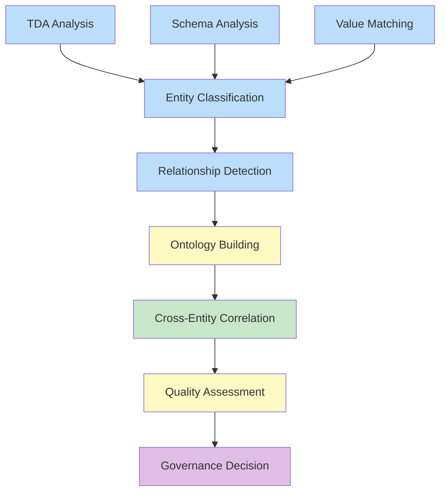
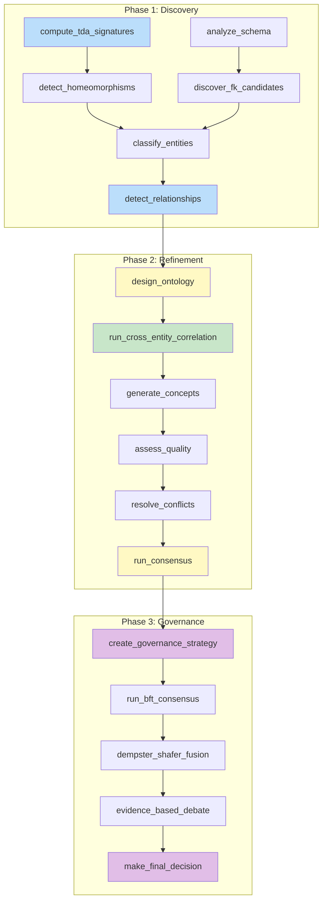

# 파이프라인 워크플로우 다이어그램

> **버전**: v14.0
> **최종 업데이트**: 2026-01-19

## 1. 전체 파이프라인 흐름

## 2. Phase 1: Discovery 상세 워크플로우

## 3. Phase 2: Refinement 상세 워크플로우

## 4. Phase 3: Governance 상세 워크플로우

## 5. Todo DAG 워크플로우

## 6. Phase Gate 검증 (v14.0)

```mermaid
flowchart TB
    subgraph P1_GATE["Phase 1 Gate"]
        P1G1{unified_entities >= 1?}
        P1G2{evidence_chain not empty?}
        P1G3{no BLOCKED todos?}
        P1G4{completion_signal == DONE?}
        P1G5["Pass → Phase 2"]
        P1G6["Fail → Fallback"]
    end

    subgraph P2_GATE["Phase 2 Gate"]
        P2G1{ontology_concepts >= 1?}
        P2G2{approved_ratio >= 0.5?}
        P2G3{no critical conflicts?}
        P2G4{completion_signal == DONE?}
        P2G5["Pass → Phase 3"]
        P2G6["Fail → Fallback"]
    end

    subgraph P3_GATE["Phase 3 Gate"]
        P3G1{governance_decisions not empty?}
        P3G2{approval_ratio >= 0.6?}
        P3G3{no ESCALATED decisions?}
        P3G4{completion_signal == DONE?}
        P3G5["Pass → Complete"]
        P3G6["Fail → Human Review"]
    end

    P1G1 --> P1G2 --> P1G3 --> P1G4
    P1G4 -->|Yes| P1G5
    P1G4 -->|No| P1G6

    P2G1 --> P2G2 --> P2G3 --> P2G4
    P2G4 -->|Yes| P2G5
    P2G4 -->|No| P2G6

    P3G1 --> P3G2 --> P3G3 --> P3G4
    P3G4 -->|Yes| P3G5
    P3G4 -->|No| P3G6

    style P1_GATE fill:#bbdefb
    style P2_GATE fill:#fff9c4
    style P3_GATE fill:#e1bee7
```

## 7. 함수 호출 흐름

