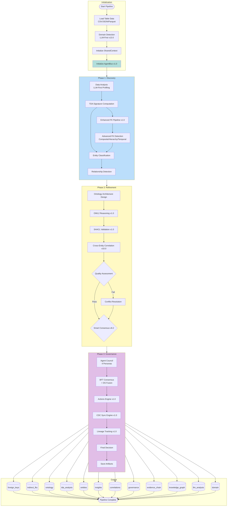
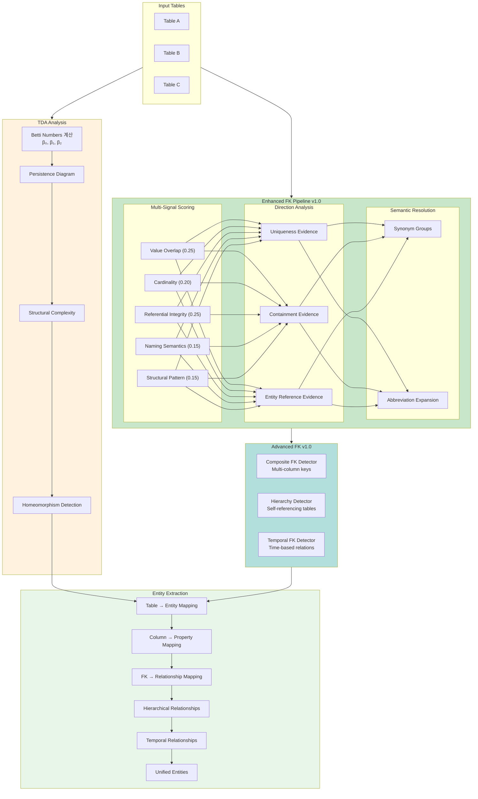
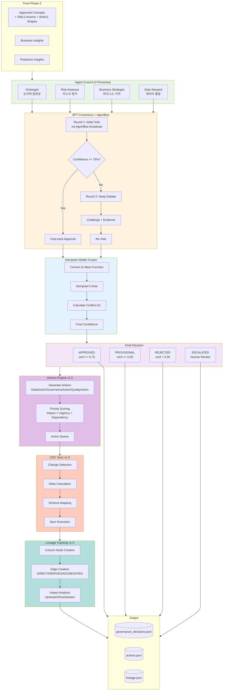
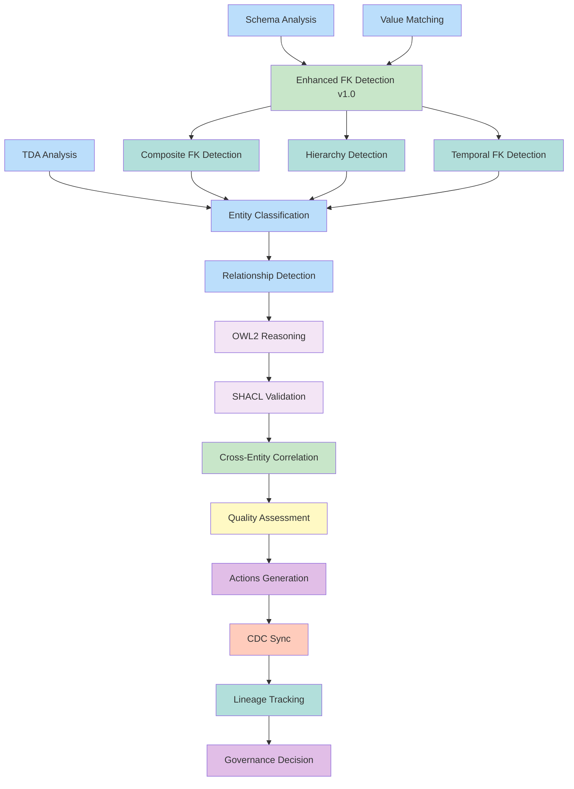
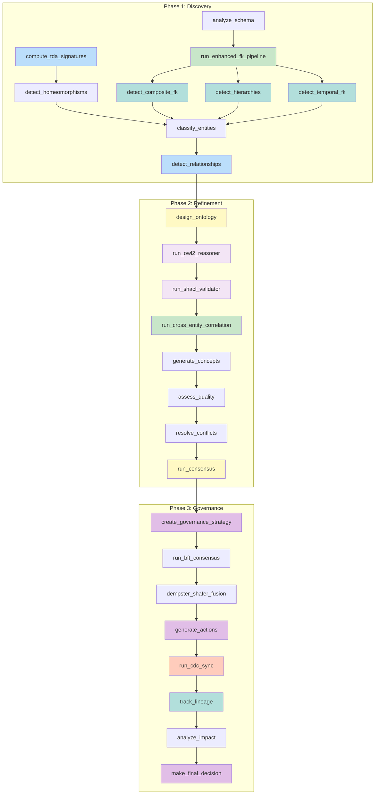
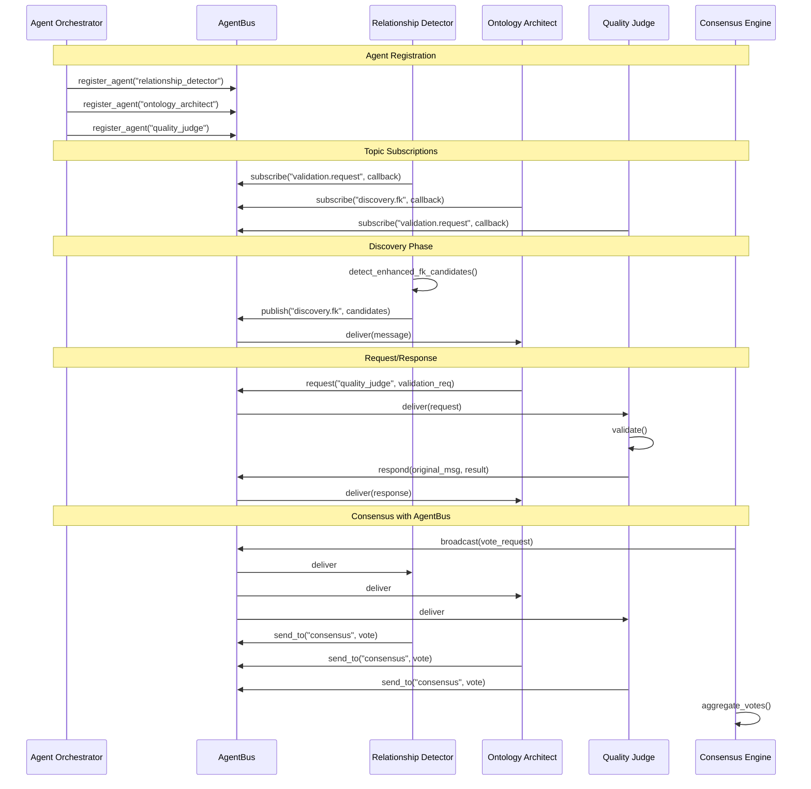
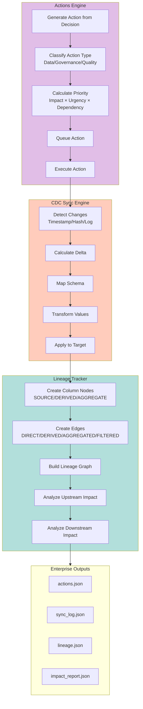

# 파이프라인 워크플로우 다이어그램

> **버전**: v1.0
> **최종 업데이트**: 2026-01-27

## 1. 전체 파이프라인 흐름



## 2. Phase 1: Discovery 상세 워크플로우 (v1.0)



## 3. Phase 2: Refinement 상세 워크플로우 (v1.0)

```mermaid
flowchart TB
    subgraph INPUT["From Phase 1"]
        UE[Unified Entities]
        FK[Enhanced FK Candidates<br/>Simple/Composite/Hierarchical/Temporal]
        TDA[TDA Signatures]
    end

    subgraph ONTO["Ontology Design"]
        O1["Design Concept Hierarchy"]
        O2["Define Property Schemas"]
        O3["Establish Relationship Types"]
        O4["Generate Concepts"]
    end

    subgraph OWL2["OWL2 Reasoning v1.0"]
        OWL1["SubClassOf Axioms"]
        OWL2["EquivalentClass Axioms"]
        OWL3["DisjointClasses Axioms"]
        OWL4["Property Domain/Range"]
        OWL5["Transitive/Inverse Properties"]
        OWL6["Axiom Inference"]
    end

    subgraph SHACL["SHACL Validation v1.0"]
        SH1["NodeShape Generation"]
        SH2["PropertyShape Generation"]
        SH3["Datatype Constraints"]
        SH4["Cardinality Constraints"]
        SH5["Pattern Constraints"]
        SH6["Validation Report"]
    end

    subgraph CEC["Cross-Entity Correlation v10.0"]
        C1["Pearson Correlation Matrix"]
        C2["Complementary Pairs Detection"]
        C3["Duplicate Columns Detection"]
        C4["Threshold Effects Analysis"]
        C5["Segment Concentration Analysis"]
        C6["Predictive Insights Generation"]
    end

    subgraph QUALITY["Quality Assessment"]
        Q1["Completeness Check"]
        Q2["Consistency Validation"]
        Q3["SHACL Conformance"]
        Q4{Score >= 0.7?}
    end

    subgraph CONFLICT["Conflict Resolution"]
        CF1["Naming Conflict Detection"]
        CF2["Semantic Overlap Detection"]
        CF3["LLM Reasoning Resolution"]
        CF4["Merge/Split Concepts"]
    end

    subgraph CONSENSUS["Smart Consensus v8.2"]
        CON1{Consensus Mode?}
        CON2["full_skip<br/>Phase 1"]
        CON3["lightweight<br/>Single LLM"]
        CON4["full_consensus<br/>Multi-Agent + AgentBus"]
        CON5["Consensus Result"]
    end

    INPUT --> ONTO
    O1 --> O2 --> O3 --> O4
    O4 --> OWL2
    OWL1 --> OWL2 --> OWL3 --> OWL4 --> OWL5 --> OWL6
    OWL6 --> SHACL
    SH1 --> SH2 --> SH3 --> SH4 --> SH5 --> SH6
    SH6 --> CEC
    C1 --> C2 --> C3 --> C4 --> C5 --> C6
    C6 --> QUALITY
    Q1 --> Q2 --> Q3 --> Q4
    Q4 -->|Yes| CONSENSUS
    Q4 -->|No| CONFLICT
    CF1 --> CF2 --> CF3 --> CF4
    CF4 --> CONSENSUS

    CON1 -->|Discovery| CON2
    CON1 -->|Few Concepts| CON3
    CON1 -->|Complex| CON4
    CON2 & CON3 & CON4 --> CON5

    style OWL2 fill:#f3e5f5
    style SHACL fill:#f3e5f5
    style CEC fill:#c8e6c9
    style ONTO fill:#e8f5e9
    style QUALITY fill:#fff3e0
    style CONFLICT fill:#ffebee
    style CONSENSUS fill:#fce4ec
```

## 4. Phase 3: Governance 상세 워크플로우 (v1.0)



## 5. Todo DAG 워크플로우 (v1.0)



## 6. Phase Gate 검증 (v1.0)

```mermaid
flowchart TB
    subgraph P1_GATE["Phase 1 Gate"]
        P1G1{unified_entities >= 1?}
        P1G2{evidence_chain not empty?}
        P1G3{no BLOCKED todos?}
        P1G4{enhanced_fk_candidates validated?}
        P1G5{completion_signal == DONE?}
        P1G6["Pass → Phase 2"]
        P1G7["Fail → Fallback"]
    end

    subgraph P2_GATE["Phase 2 Gate"]
        P2G1{ontology_concepts >= 1?}
        P2G2{owl2_axioms generated?}
        P2G3{shacl_validation passed?}
        P2G4{approved_ratio >= 0.5?}
        P2G5{no critical conflicts?}
        P2G6{completion_signal == DONE?}
        P2G7["Pass → Phase 3"]
        P2G8["Fail → Fallback"]
    end

    subgraph P3_GATE["Phase 3 Gate"]
        P3G1{governance_decisions not empty?}
        P3G2{recommended_actions generated?}
        P3G3{lineage_tracked?}
        P3G4{approval_ratio >= 0.6?}
        P3G5{no ESCALATED decisions?}
        P3G6{completion_signal == DONE?}
        P3G7["Pass → Complete"]
        P3G8["Fail → Human Review"]
    end

    P1G1 --> P1G2 --> P1G3 --> P1G4 --> P1G5
    P1G5 -->|Yes| P1G6
    P1G5 -->|No| P1G7

    P2G1 --> P2G2 --> P2G3 --> P2G4 --> P2G5 --> P2G6
    P2G6 -->|Yes| P2G7
    P2G6 -->|No| P2G8

    P3G1 --> P3G2 --> P3G3 --> P3G4 --> P3G5 --> P3G6
    P3G6 -->|Yes| P3G7
    P3G6 -->|No| P3G8

    style P1_GATE fill:#bbdefb
    style P2_GATE fill:#fff9c4
    style P3_GATE fill:#e1bee7
```



## 7. 함수 호출 흐름 (v1.0)



## 8. AgentBus 통합 워크플로우 (v1.0)



## 9. v1.0 Enterprise 워크플로우


