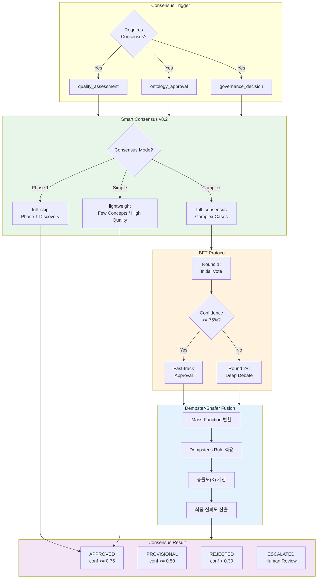
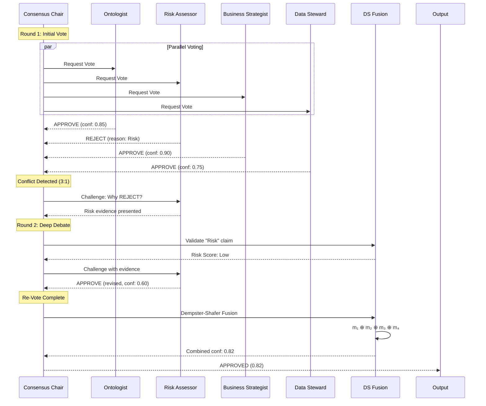
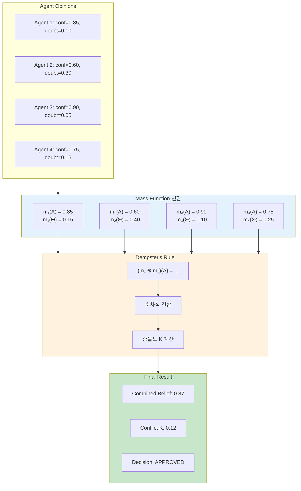
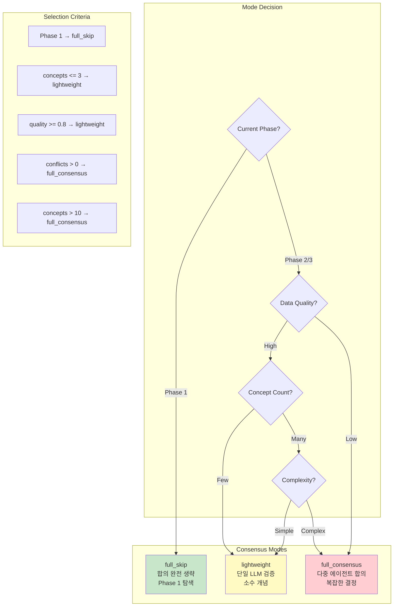
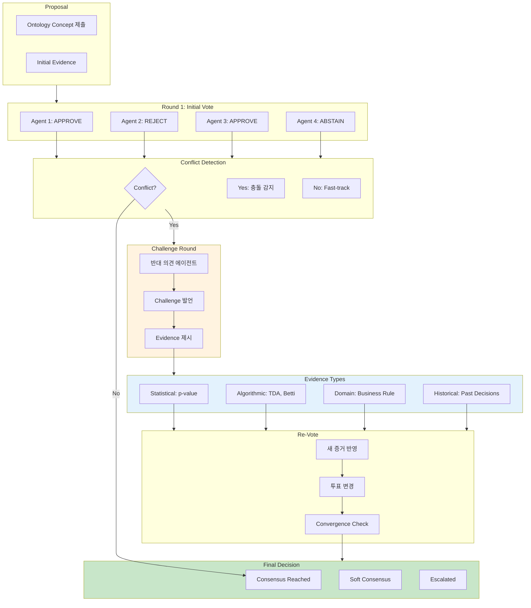
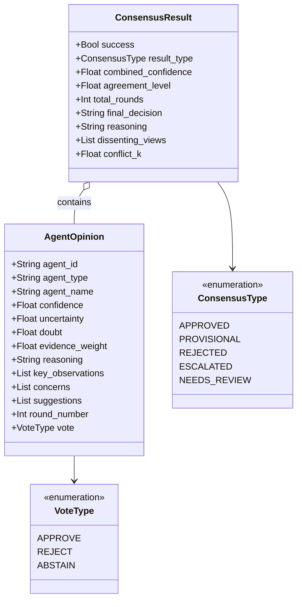
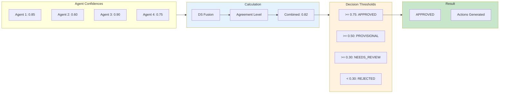
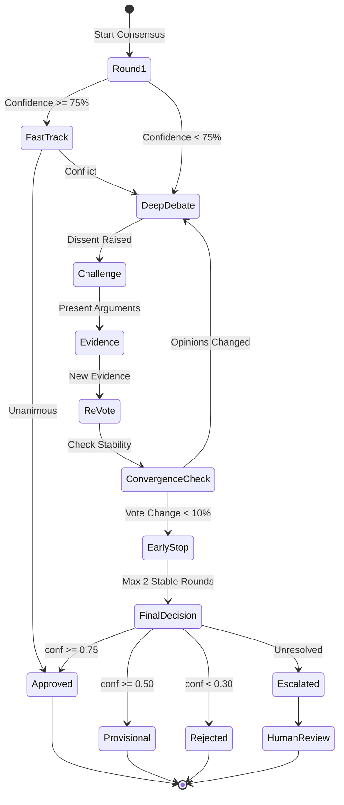
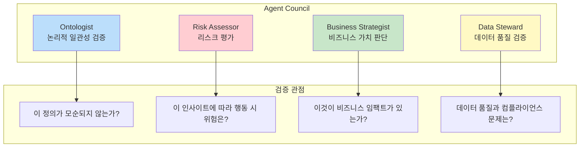

# 합의 엔진 다이어그램

> **버전**: v14.0
> **최종 업데이트**: 2026-01-19

## 1. 합의 엔진 개요 (v7.0+)

## 2. BFT 합의 프로세스

## 3. Dempster-Shafer Fusion 상세

## 4. Smart Consensus 모드 결정 (v8.2)

## 5. Evidence-Based Debate (v11.0)

## 6. Agent Opinion 데이터 구조

## 7. 합의 결과 임계값

## 8. Convergence Detection

## 9. Agent Council 4인 위원회

