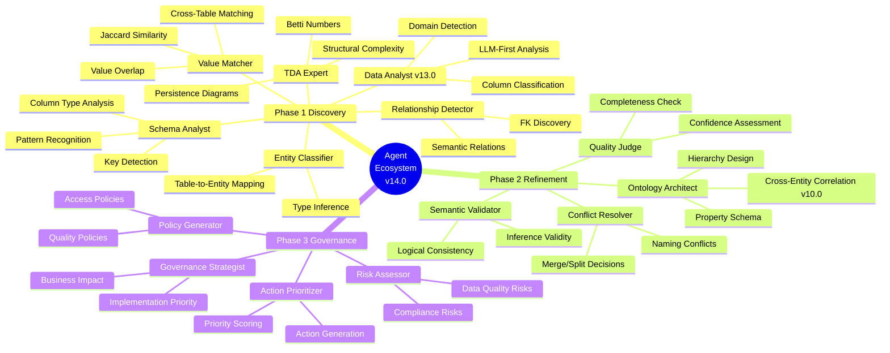
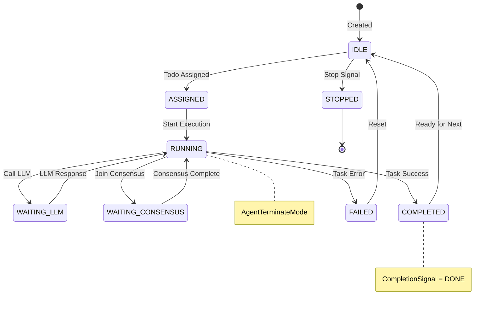
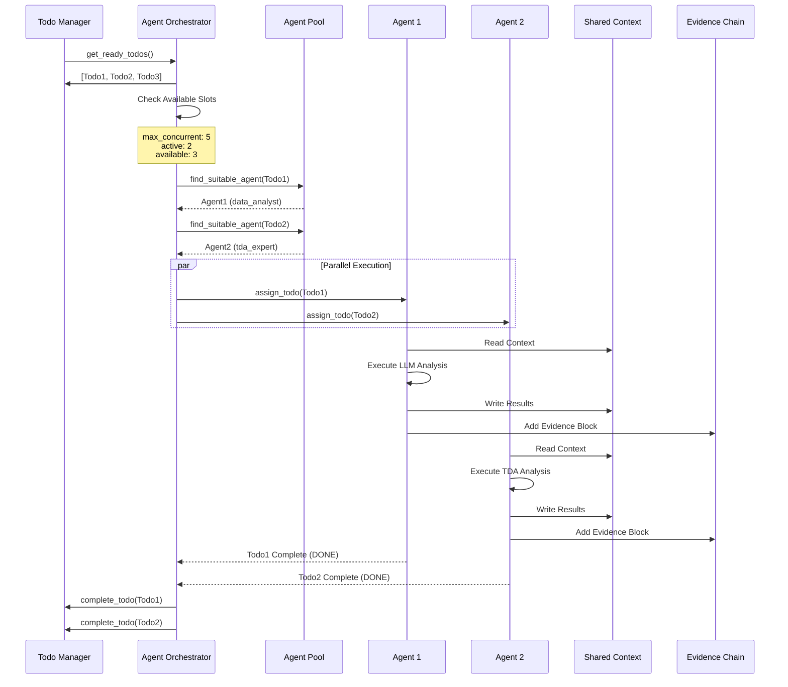
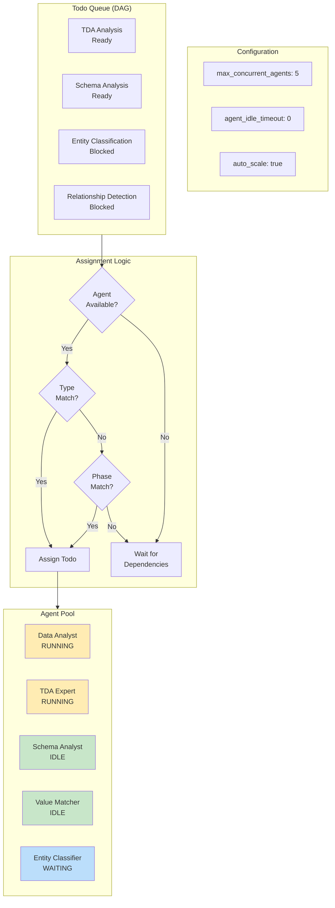
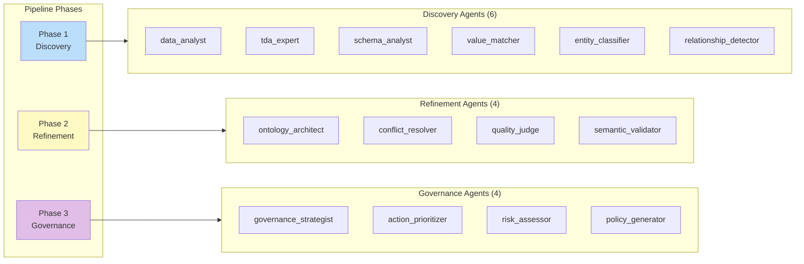
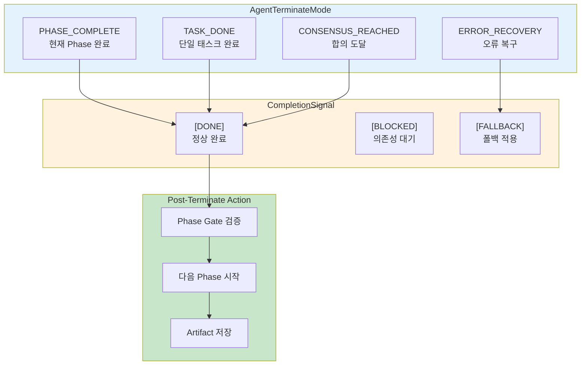
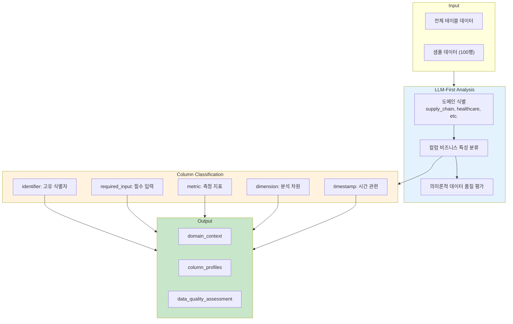

# 에이전트 오케스트레이션 다이어그램

> **버전**: v14.0
> **최종 업데이트**: 2026-01-19

## 1. 에이전트 계층 구조

```mermaid
graph TB
    subgraph BASE["Base Agent"]
        BA[AutonomousAgent<br/>base.py]
    end

    subgraph PHASE1["Phase 1: Discovery Agents (6)"]
        P1A[Data Analyst<br/>v13.0 LLM-First]
        P1B[TDA Expert<br/>tda_expert]
        P1C[Schema Analyst<br/>schema_analyst]
        P1D[Value Matcher<br/>value_matcher]
        P1E[Entity Classifier<br/>entity_classifier]
        P1F[Relationship Detector<br/>relationship_detector]
    end

    subgraph PHASE2["Phase 2: Refinement Agents (4)"]
        P2A[Ontology Architect<br/>+ Cross-Entity Correlation]
        P2B[Conflict Resolver<br/>conflict_resolver]
        P2C[Quality Judge<br/>quality_judge]
        P2D[Semantic Validator<br/>semantic_validator]
    end

    subgraph PHASE3["Phase 3: Governance Agents (4)"]
        P3A[Governance Strategist<br/>governance_strategist]
        P3B[Action Prioritizer<br/>action_prioritizer]
        P3C[Risk Assessor<br/>risk_assessor]
        P3D[Policy Generator<br/>policy_generator]
    end

    BA --> P1A & P1B & P1C & P1D & P1E & P1F
    BA --> P2A & P2B & P2C & P2D
    BA --> P3A & P3B & P3C & P3D

    style PHASE1 fill:#bbdefb
    style PHASE2 fill:#fff9c4
    style PHASE3 fill:#e1bee7
```

## 2. 14개 에이전트 역할 맵

## 3. 에이전트 상태 머신

## 4. Todo 할당 및 실행 흐름

## 5. 에이전트 풀 관리

## 6. Phase별 에이전트 배치

## 7. 에이전트 간 통신 패턴

```mermaid
flowchart TB
    subgraph DIRECT["Direct Communication"]
        AG1[Agent] -->|call_llm| LLM[LLM Service]
        LLM -->|response| AG1
    end

    subgraph SHARED["Shared Context"]
        AG2[Agent A] -->|write| SC[(Shared Context)]
        SC -->|read| AG3[Agent B]
    end

    subgraph EVIDENCE["Evidence Chain"]
        AG4[Agent 1] -->|add_block| EC[Evidence Chain]
        EC -->|verify| AG5[Agent 2]
    end

    subgraph CONSENSUS["Consensus Communication"]
        AG6[Agent] -->|opinion| CE[Consensus Engine]
        CE -->|aggregate| CE
        CE -->|result| AG6
    end

    style DIRECT fill:#e3f2fd
    style SHARED fill:#e8f5e9
    style EVIDENCE fill:#fff3e0
    style CONSENSUS fill:#fce4ec
```

## 8. 에이전트 실행 타임라인

```mermaid
gantt
    title Agent Execution Timeline (v14.0)
    dateFormat  HH:mm:ss
    axisFormat %H:%M:%S

    section Phase 1
    Data Analyst (LLM)   :a1, 00:00:00, 40s
    TDA Expert           :a2, 00:00:05, 30s
    Schema Analyst       :a3, 00:00:10, 25s
    Value Matcher        :a4, after a2, 20s
    Entity Classifier    :a5, after a3 a4, 15s
    Relationship Detector:a6, after a5, 20s

    section Phase 2
    Ontology Architect   :b1, after a6, 35s
    Cross-Entity Corr    :b2, after b1, 30s
    Quality Judge        :b3, after b2, 25s
    Conflict Resolver    :b4, after b3, 20s
    Semantic Validator   :b5, after b4, 15s
    Smart Consensus      :b6, after b5, 30s

    section Phase 3
    Governance Strategist:c1, after b6, 25s
    Risk Assessor        :c2, after c1, 20s
    Action Prioritizer   :c3, after c2, 20s
    Policy Generator     :c4, after c3, 15s
    BFT Consensus        :c5, after c4, 35s
```

## 9. Agent Terminate Mode (v14.0)

## 10. Data Analyst v13.0 상세

