# 에이전트 오케스트레이션 다이어그램

> **버전**: v1.0
> **최종 업데이트**: 2026-01-27

## 1. 에이전트 계층 구조 (v1.0)

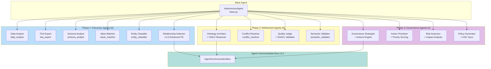

## 2. 14개 에이전트 역할 맵 (v1.0)

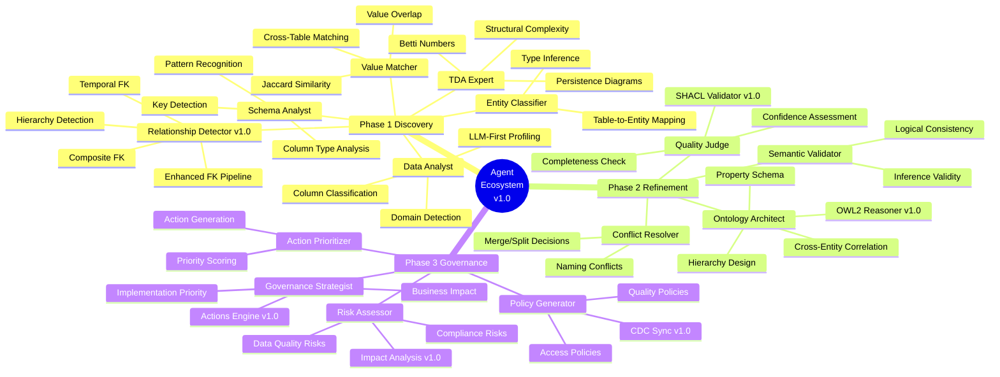

## 3. 에이전트 상태 머신

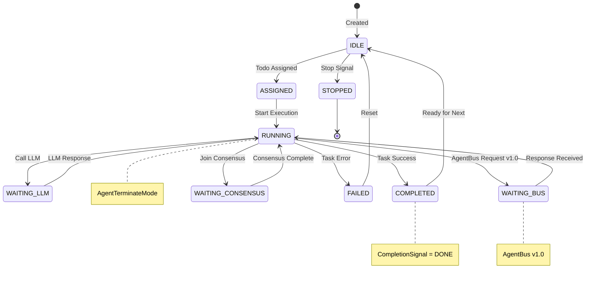

## 4. Todo 할당 및 실행 흐름 (v1.0)

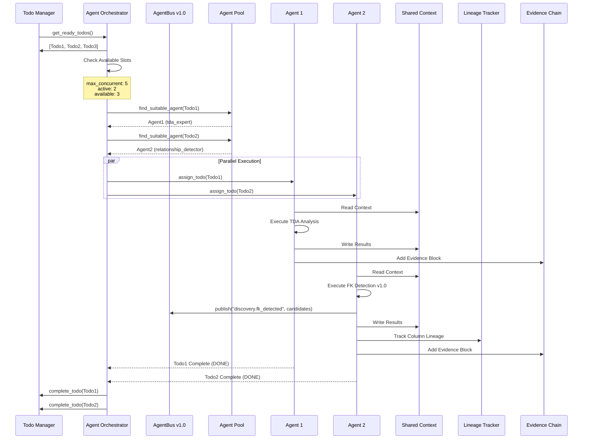

## 5. 에이전트 풀 관리 (v1.0)

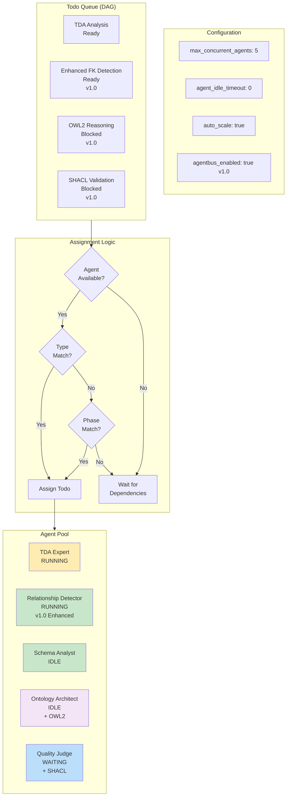

## 6. Phase별 에이전트 배치 (v1.0)

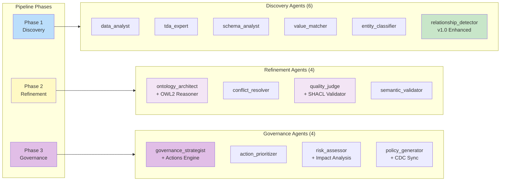

## 7. 에이전트 간 통신 패턴 (v1.0 AgentBus)

```mermaid
flowchart TB
    subgraph DIRECT["Direct Messaging"]
        AG1[Agent A] -->|send_to| BUS1[AgentBus]
        BUS1 -->|deliver| AG2[Agent B]
    end

    subgraph BROADCAST["Broadcast"]
        AG3[Agent] -->|broadcast| BUS2[AgentBus]
        BUS2 -->|deliver| AG4[All Agents]
    end

    subgraph REQRES["Request/Response"]
        AG5[Agent A] -->|request| BUS3[AgentBus]
        BUS3 -->|deliver + wait| AG6[Agent B]
        AG6 -->|respond| BUS3
        BUS3 -->|return| AG5
    end

    subgraph PUBSUB["Pub/Sub Topics"]
        AG7[Publisher] -->|publish topic| BUS4[AgentBus]
        BUS4 -->|notify| AG8[Subscriber 1]
        BUS4 -->|notify| AG9[Subscriber 2]
    end

    subgraph SHARED["Shared Context (Legacy)"]
        AG10[Agent A] -->|write| SC[(Shared Context)]
        SC -->|read| AG11[Agent B]
    end

    style DIRECT fill:#e3f2fd
    style BROADCAST fill:#b2dfdb
    style REQRES fill:#fff9c4
    style PUBSUB fill:#c8e6c9
    style SHARED fill:#f3e5f5
```

## 8. AgentBus 통합 상세 (v1.0)

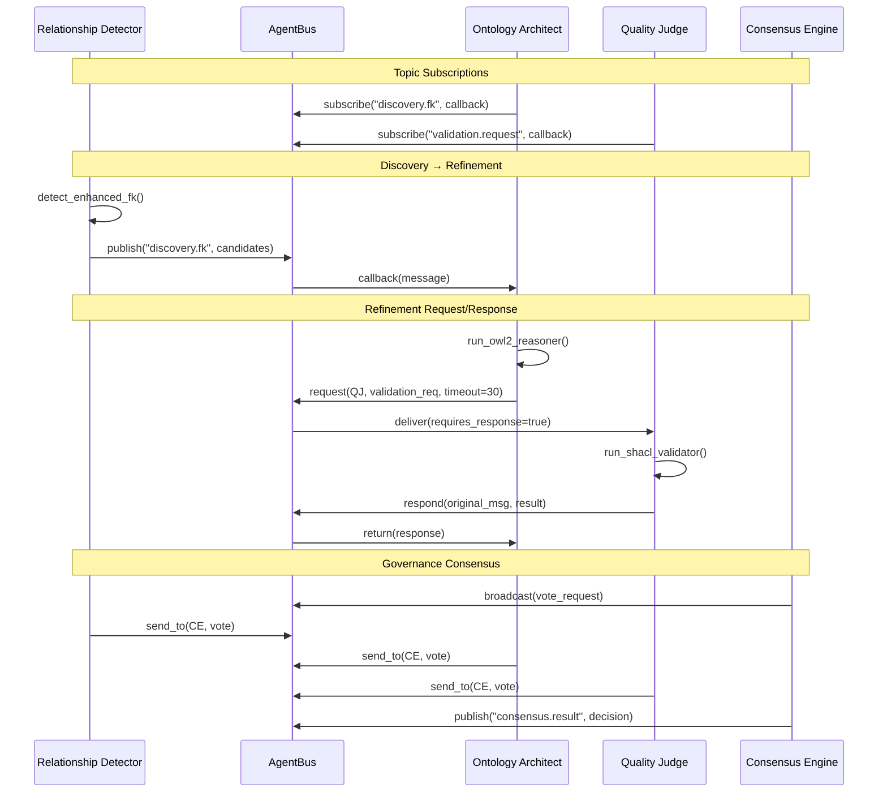

## 9. 에이전트 실행 타임라인 (v1.0)

```mermaid
gantt
    title Agent Execution Timeline (v1.0)
    dateFormat  HH:mm:ss
    axisFormat %H:%M:%S

    section Phase 1
    TDA Expert           :a2, 00:00:00, 30s
    Schema Analyst       :a3, 00:00:05, 25s
    Value Matcher        :a4, after a2, 20s
    Entity Classifier    :a5, after a3 a4, 15s
    Relationship Detector v1.0 :a6, after a5, 25s

    section Phase 2
    Ontology Architect + OWL2 :b1, after a6, 40s
    SHACL Validation     :b2, after b1, 25s
    Cross-Entity Corr    :b3, after b2, 30s
    Quality Judge        :b4, after b3, 25s
    Conflict Resolver    :b5, after b4, 20s
    Smart Consensus      :b6, after b5, 30s

    section Phase 3
    Governance Strategist :c1, after b6, 25s
    Actions Engine v1.0 :c2, after c1, 20s
    Risk + Impact Analysis :c3, after c2, 25s
    CDC Sync v1.0       :c4, after c3, 20s
    Lineage Tracking     :c5, after c4, 15s
    BFT Consensus        :c6, after c5, 35s
```

## 10. Agent Terminate Mode (v1.0)

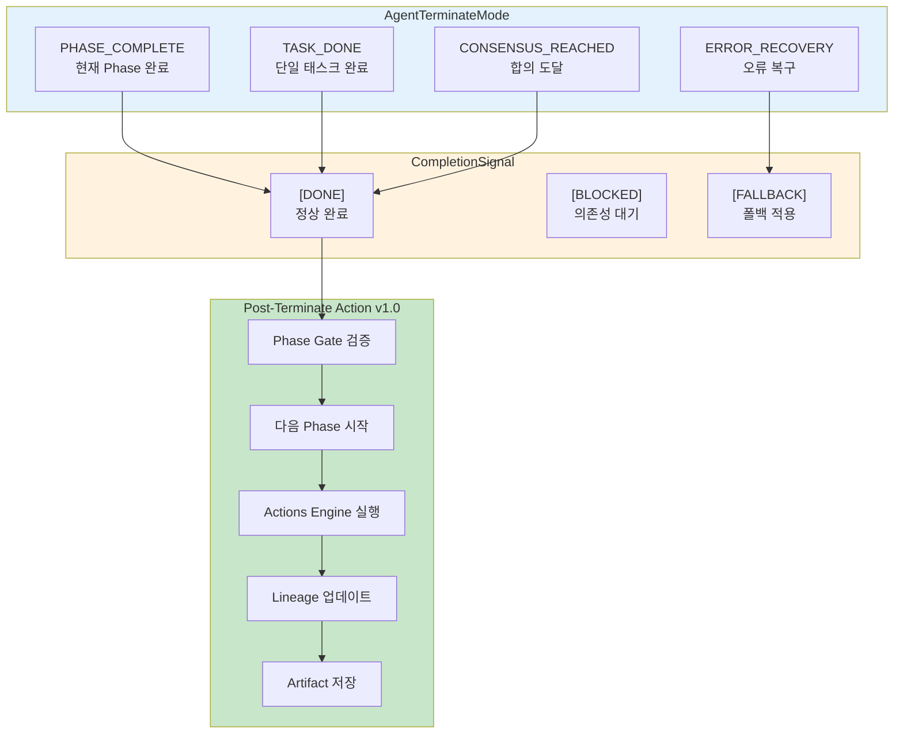

## 11. v1.0 Agent-Module 연결 맵

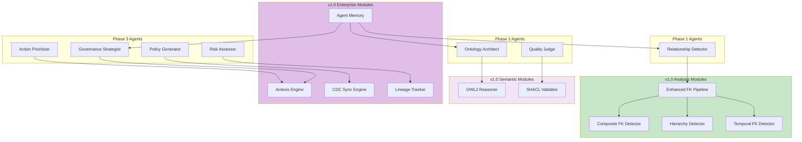

## 12. TDA Expert 에이전트 상세

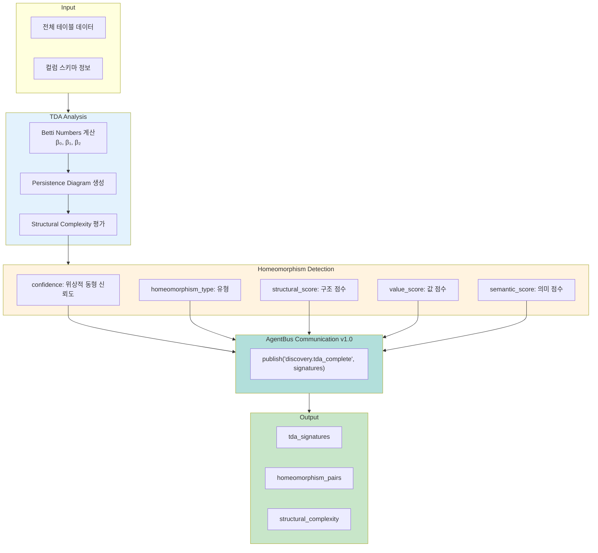
