# 지식 그래프 다이어그램

> **버전**: v14.0
> **최종 업데이트**: 2026-01-19

## 1. 지식 그래프 엔진 구조

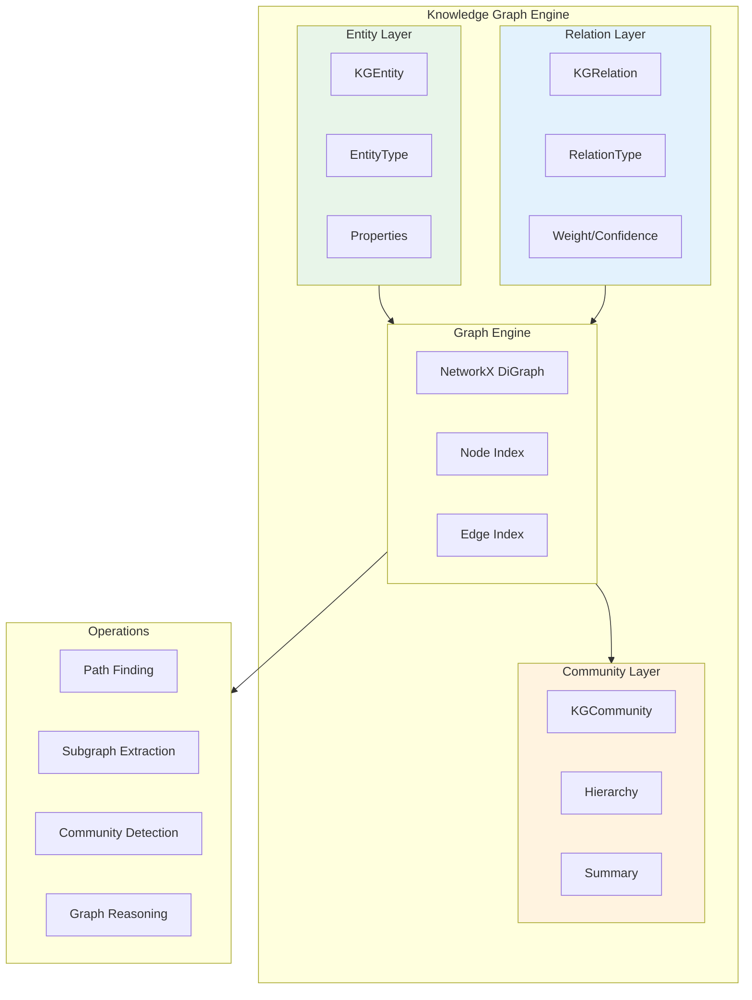

## 2. 엔티티 타입

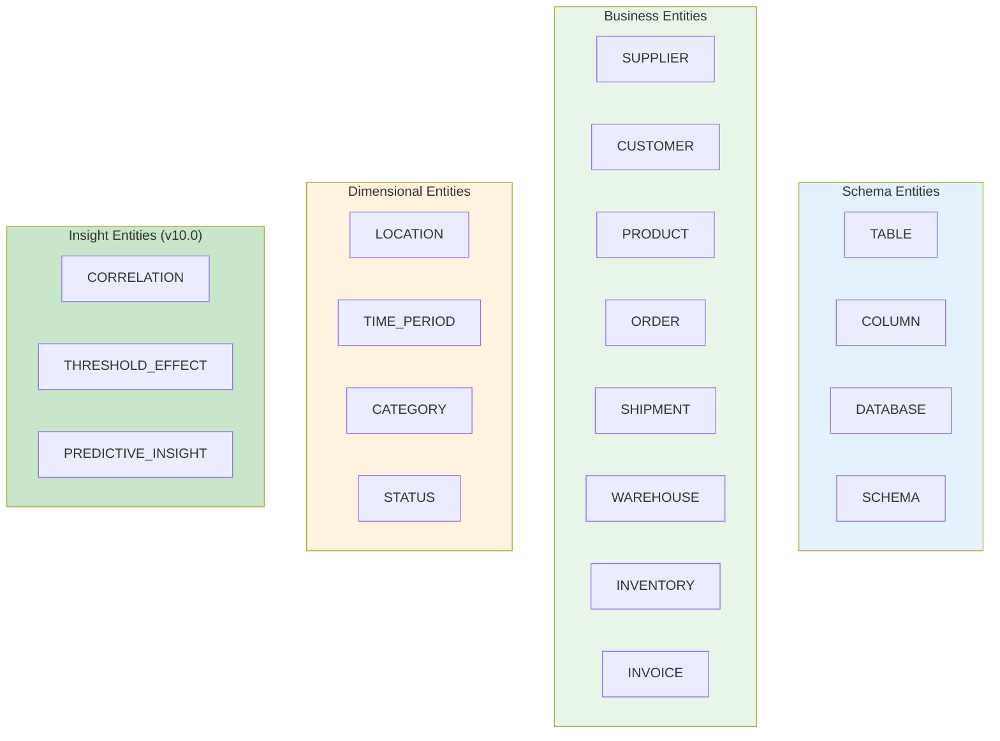

## 3. 관계 타입

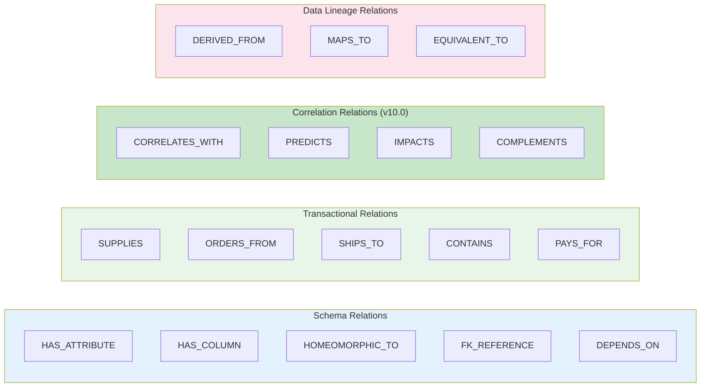

## 4. Supply Chain 예시 그래프

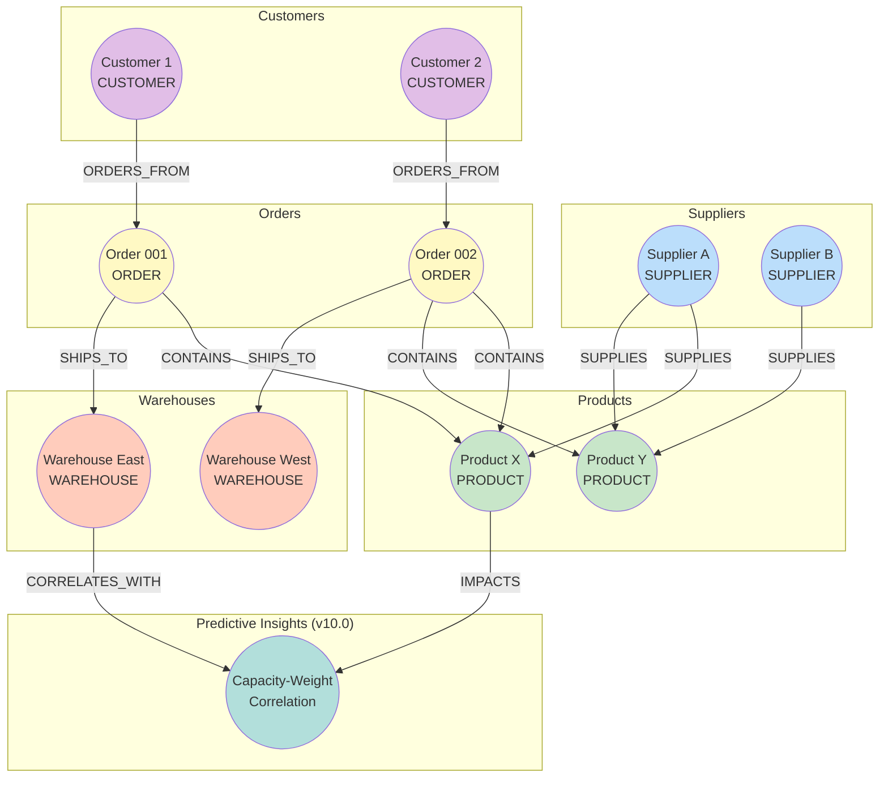

## 5. 커뮤니티 탐지

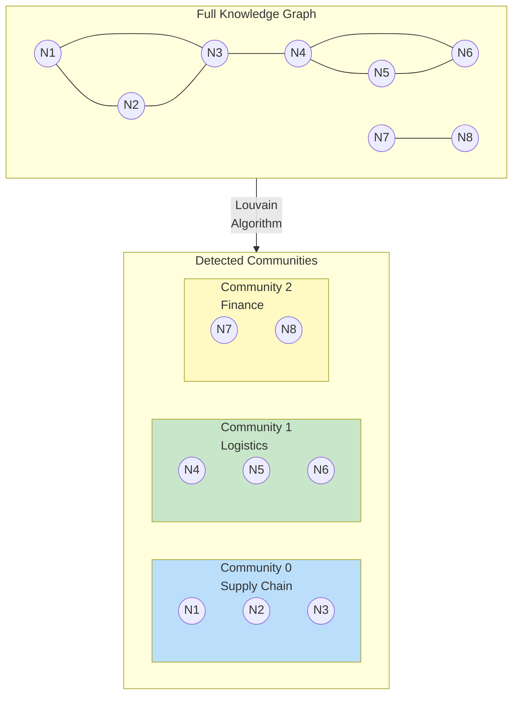

## 6. 경로 탐색

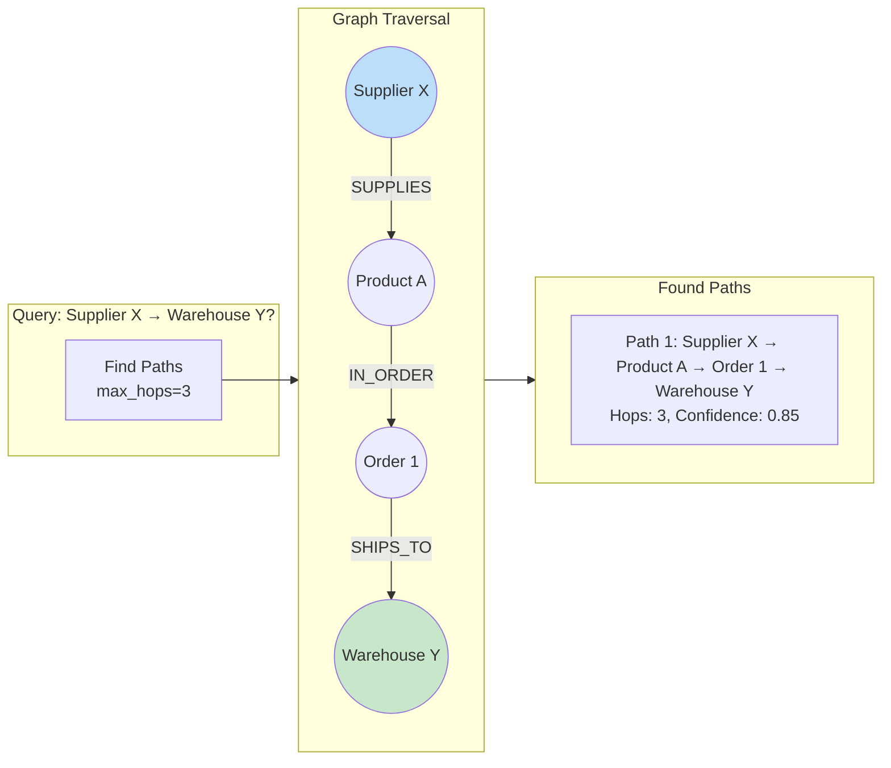

## 7. 데이터 구조

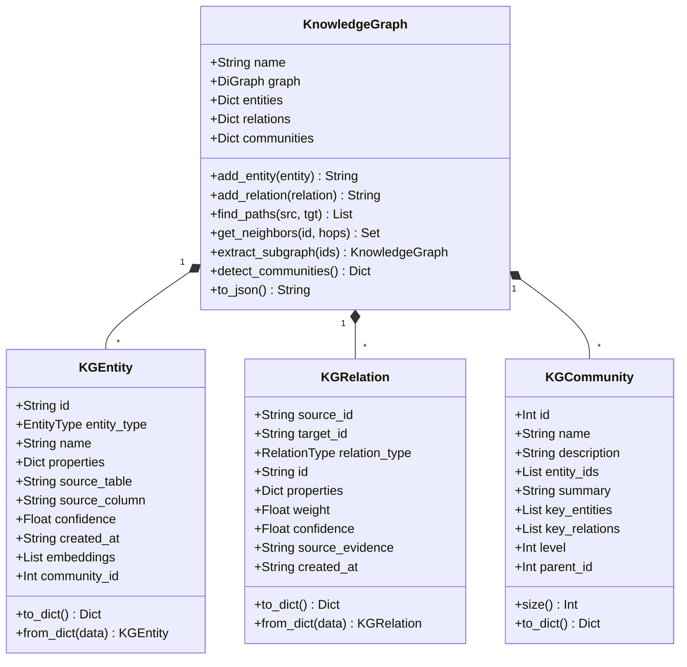

## 8. Cross-Entity Correlation 통합 (v10.0)

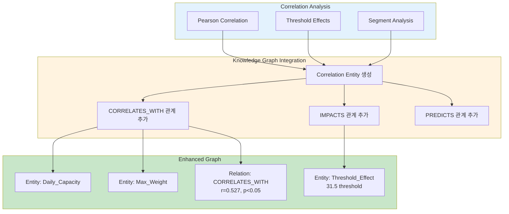

## 9. 그래프 직렬화

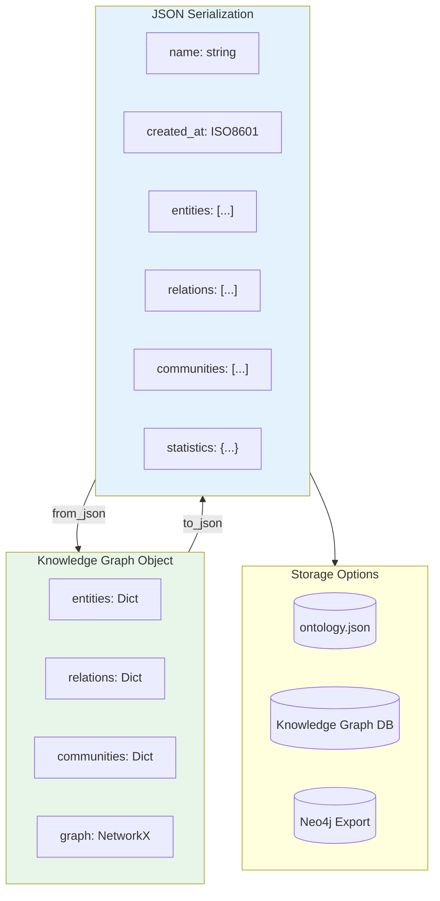

## 10. 그래프 통계

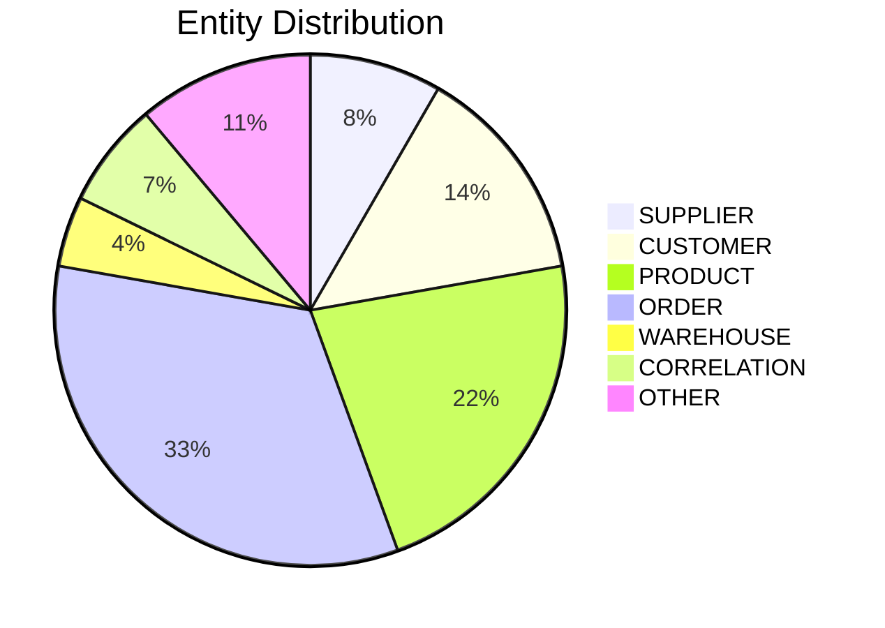

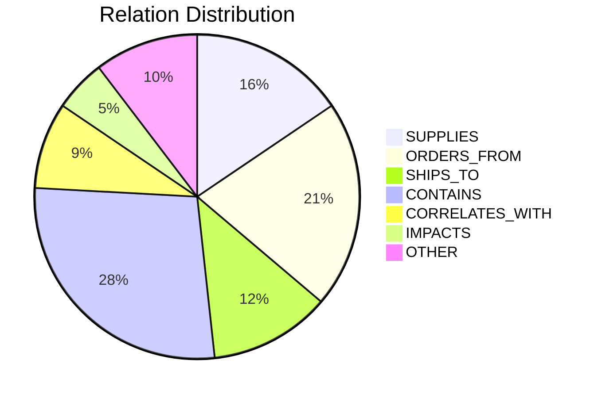
