# 지식 그래프 다이어그램

> **버전**: v1.0
> **최종 업데이트**: 2026-01-27

## 1. 지식 그래프 엔진 구조 (v1.0)

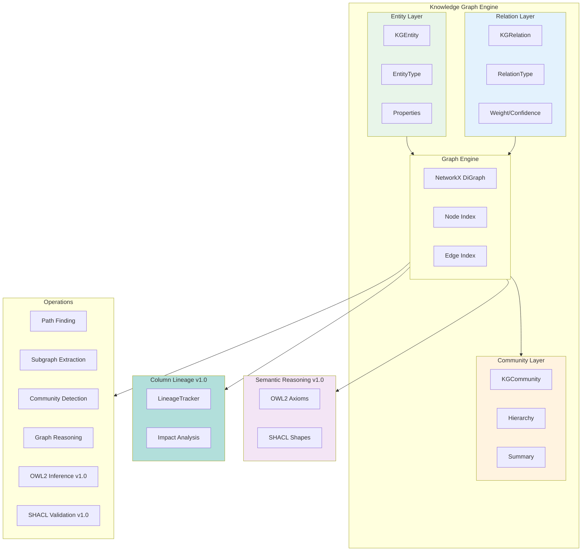

## 2. 엔티티 타입 (v1.0)

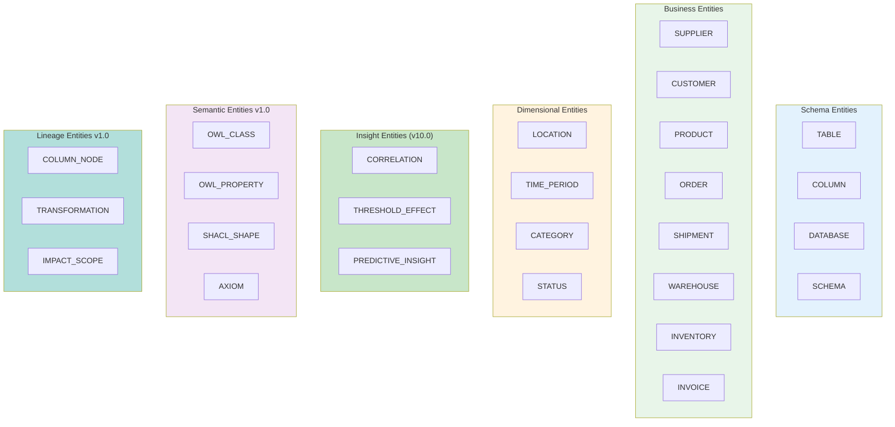

## 3. 관계 타입 (v1.0)

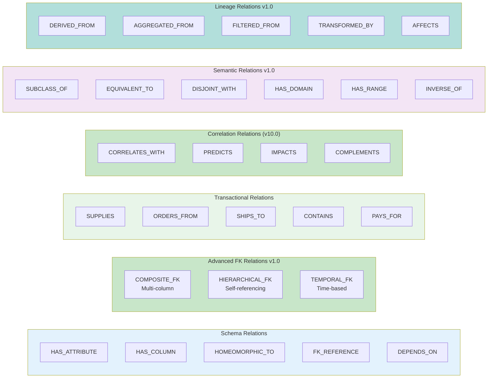

## 4. OWL2 Ontology Structure (v1.0)

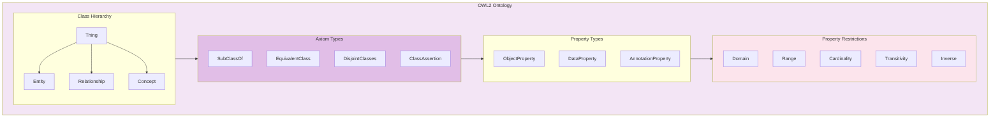

## 5. SHACL Shapes Structure (v1.0)

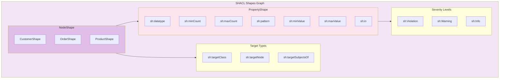

## 6. Column Lineage Graph (v1.0)

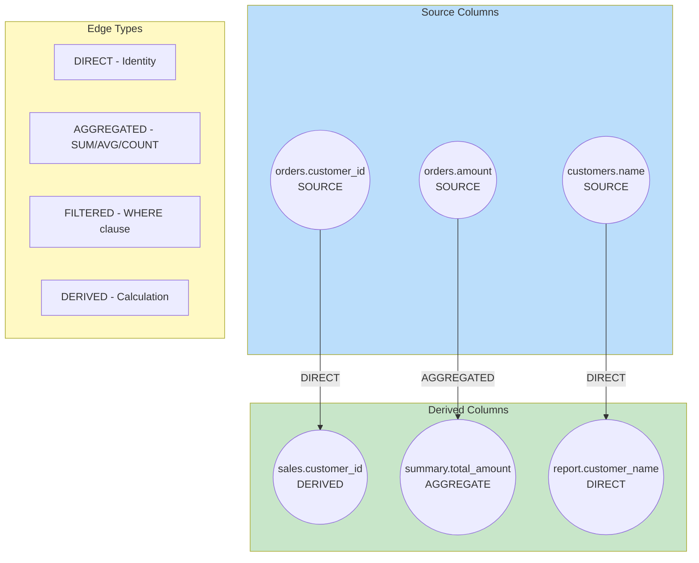

## 7. Impact Analysis Flow (v1.0)

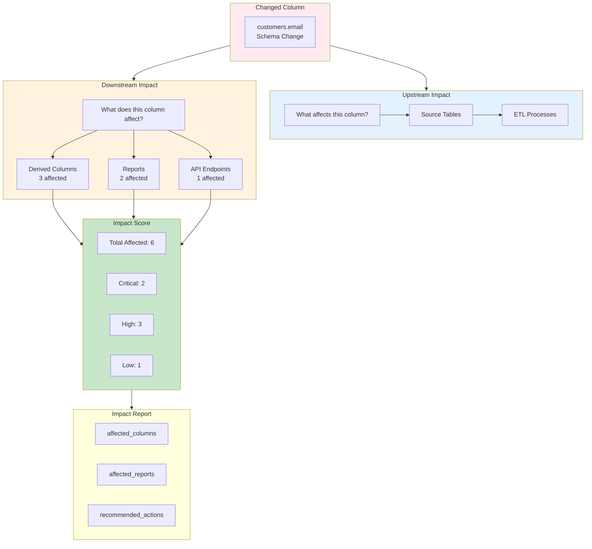

## 8. Supply Chain 예시 그래프 (v1.0)

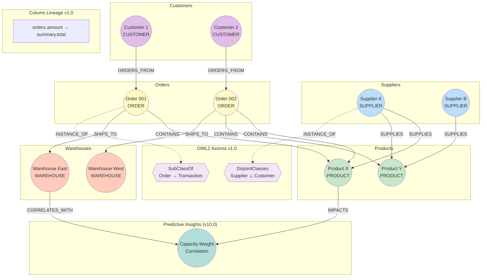

## 9. 데이터 구조 (v1.0)

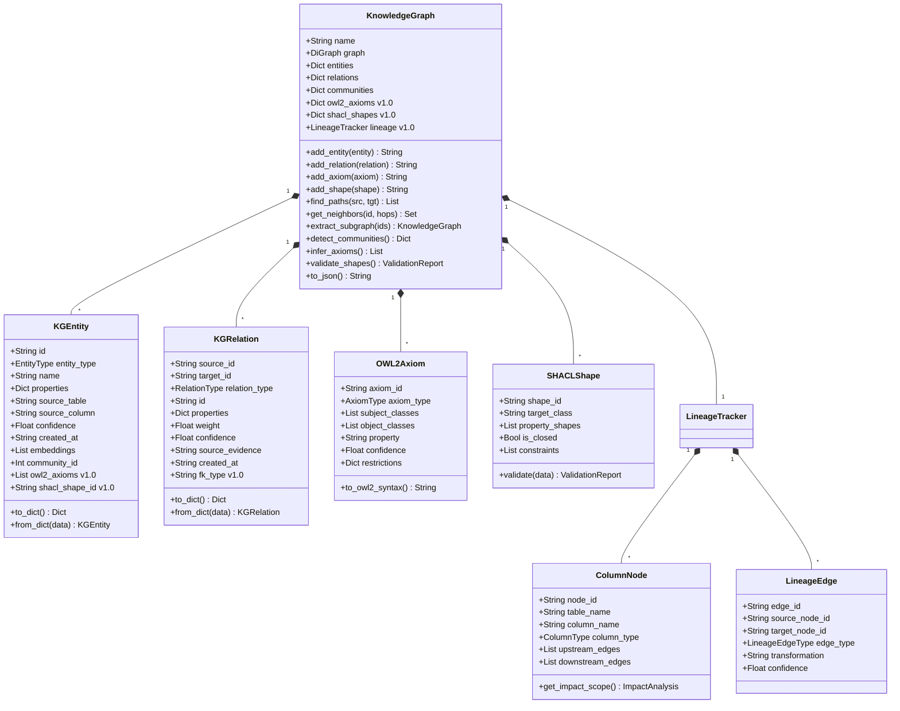

## 10. 그래프 통계 (v1.0)

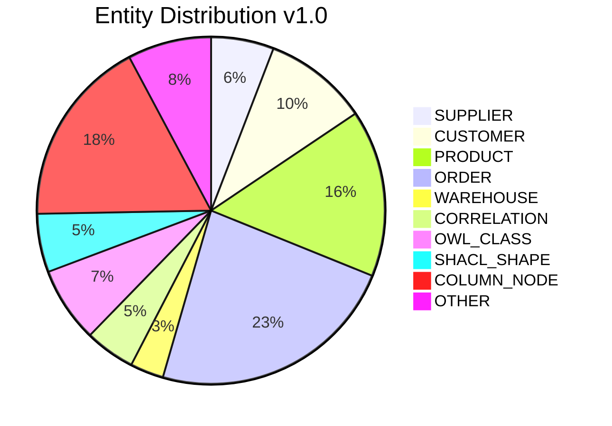

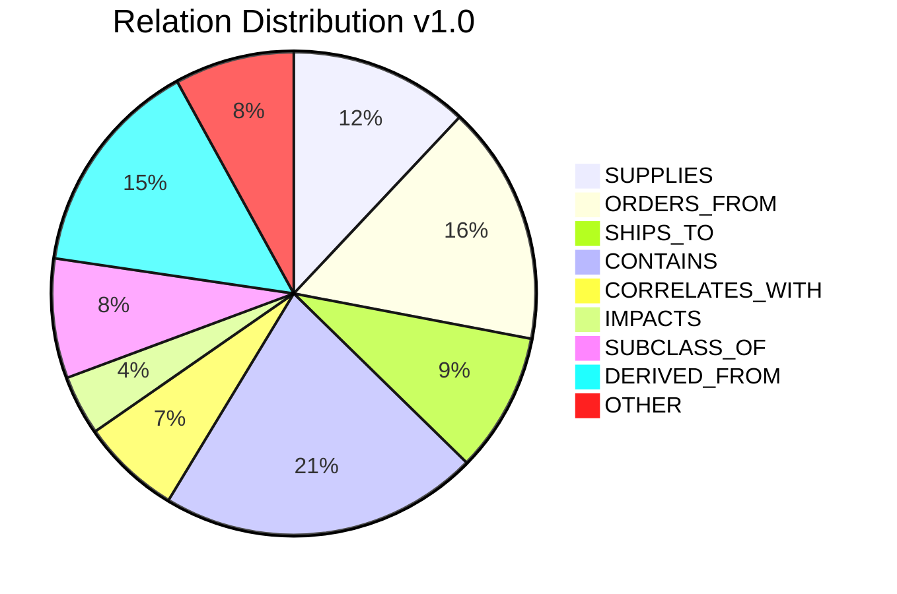

## 11. 그래프 직렬화 (v1.0)

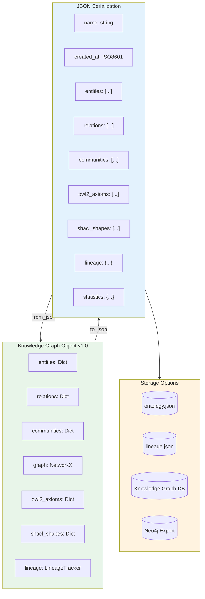
