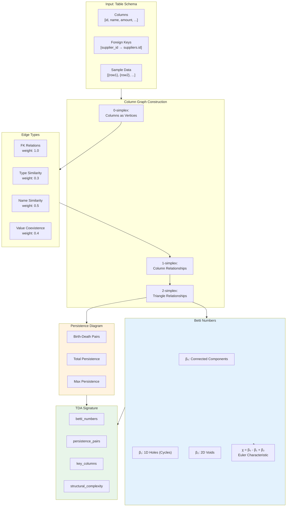
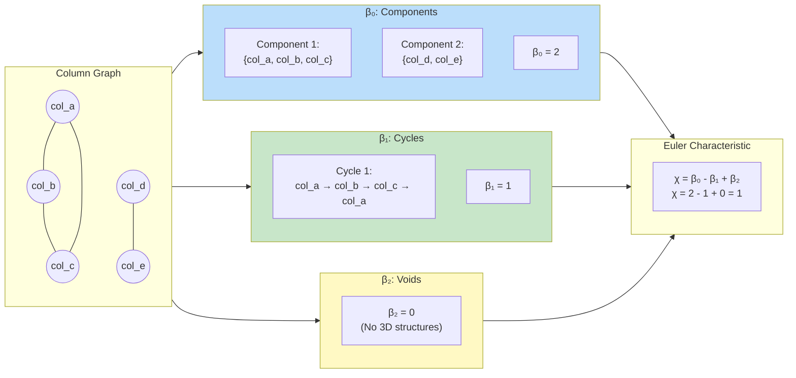
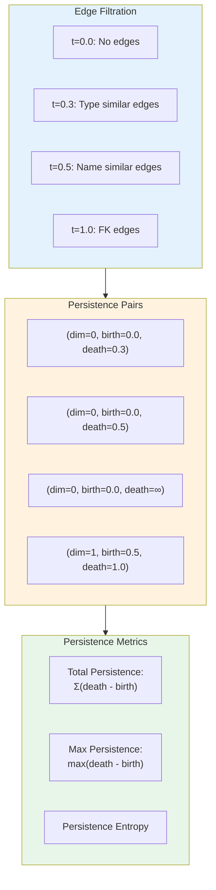
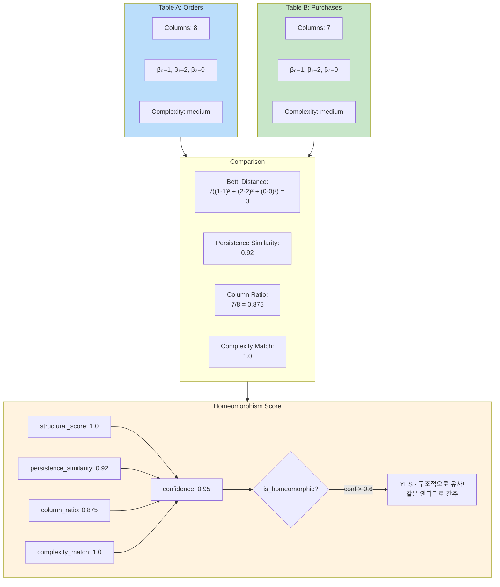
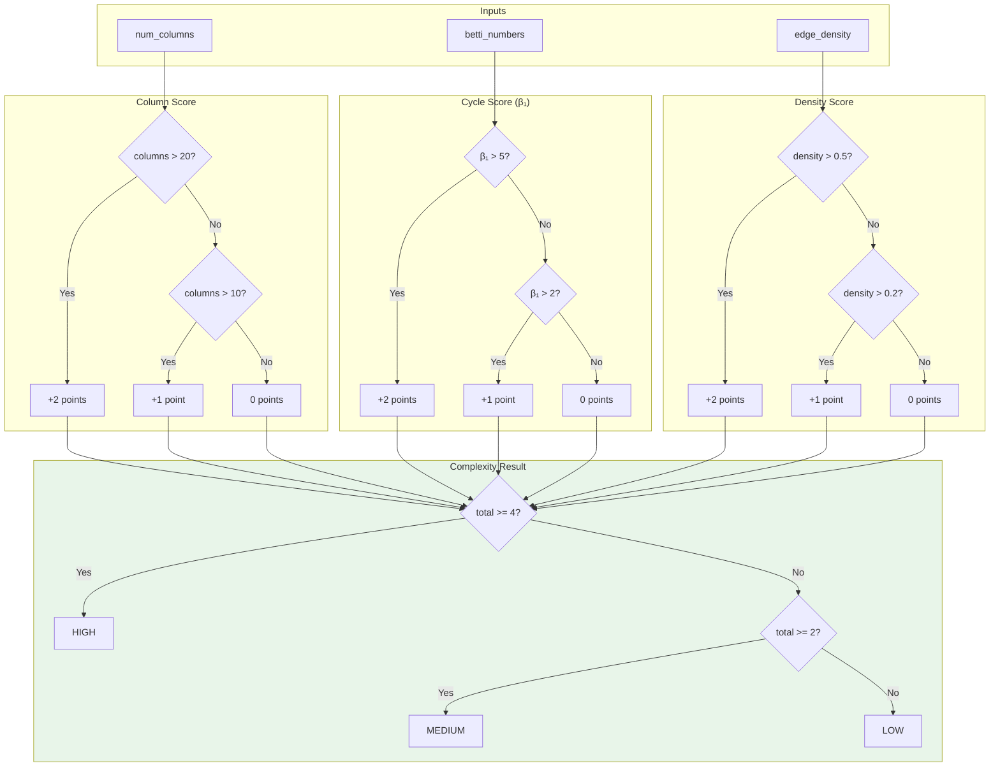
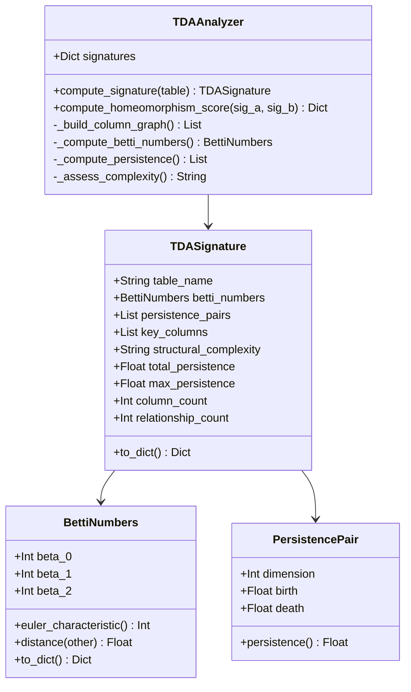
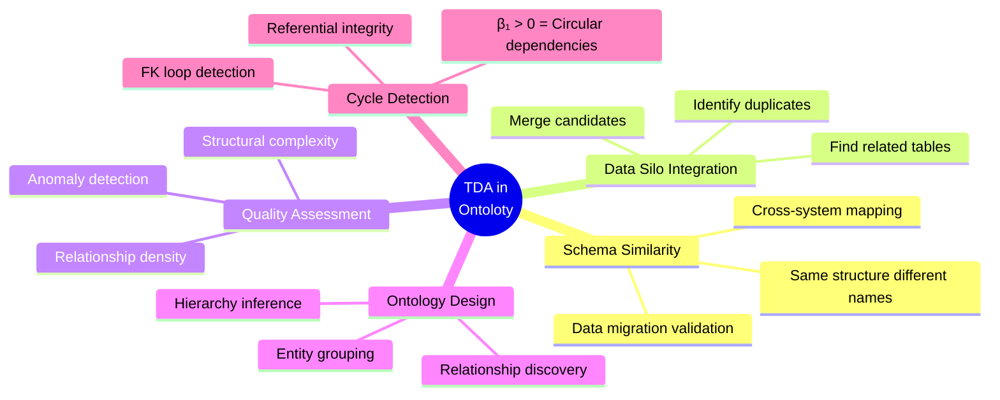
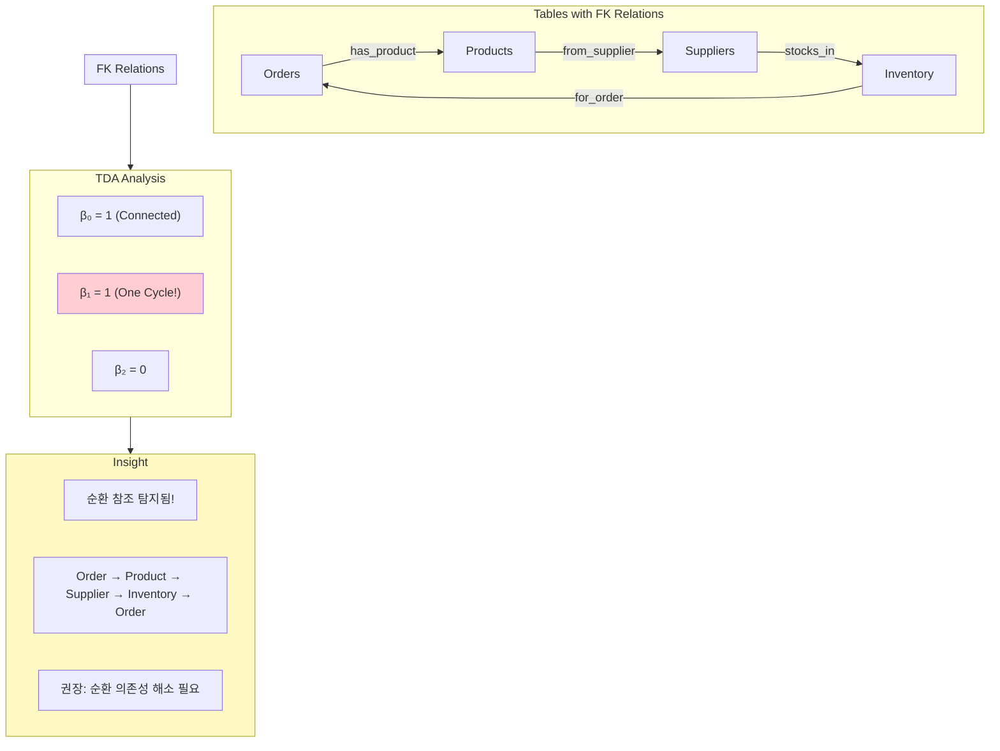
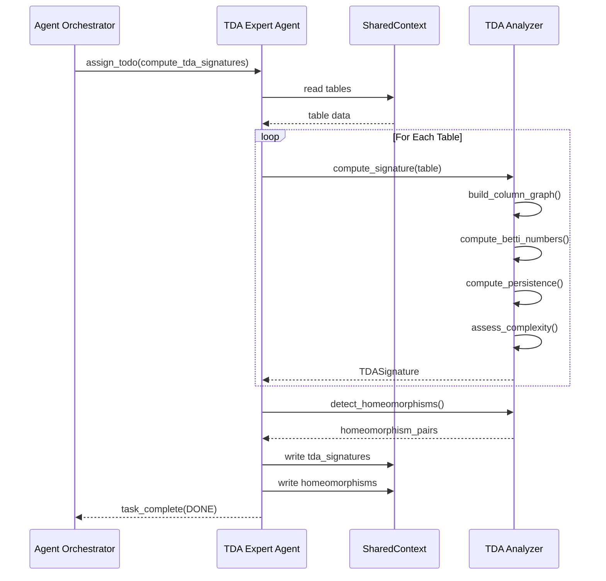
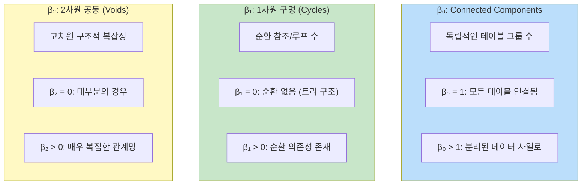

# TDA (위상 데이터 분석) 다이어그램

> **버전**: v14.0
> **최종 업데이트**: 2026-01-19

## 1. TDA 분석 파이프라인

## 2. Betti Numbers 계산

## 3. Persistence Diagram

## 4. Homeomorphism Detection (위상적 동형성)

## 5. Structural Complexity 계산

## 6. TDA 데이터 구조

## 7. TDA 활용 사례

## 8. 순환 참조 탐지 (β₁ > 0)

## 9. TDA Expert 에이전트 흐름

## 10. Betti Numbers 의미 요약

