# 도메인 탐지 다이어그램

> **버전**: v1.0
> **최종 업데이트**: 2026-01-27

## 1. 도메인 탐지 파이프라인 (LLM-First v13.0)

## 2. 지원 도메인

## 3. 도메인별 키워드 패턴

## 4. 도메인 탐지 흐름 (v1.0 통합)

## 5. Supply Chain 도메인 예시

## 6. Web Analytics 도메인 예시

## 7. 컬럼 비즈니스 특성 분류

```mermaid
flowchart TB
    subgraph COLUMN_TYPES["Column Business Types"]
        CT1["identifier<br/>고유 식별자"]
        CT2["required_input<br/>필수 입력 필드"]
        CT3["metric<br/>측정 지표"]
        CT4["dimension<br/>분석 차원"]
        CT5["timestamp<br/>시간 관련"]
    end

    subgraph EXAMPLES["Examples"]
        EX1["order_id, customer_id"]
        EX2["plant_code, carrier_code"]
        EX3["rate, weight, capacity"]
        EX4["channel, category, region"]
        EX5["created_at, order_date"]
    end

    subgraph USAGE["Usage in Analysis"]
        U1["PK/FK 관계 추론"]
        U2["엔티티 속성 정의"]
        U3["Cross-Entity Correlation"]
        U4["세그먼트 분석"]
        U5["시계열 분석"]
    end

    subgraph V16_MAPPING["v1.0 Module Mapping"]
        V1["Enhanced FK Pipeline"]
        V2["OWL2 Property Definition"]
        V3["SHACL Constraint Inference"]
        V4["Column Lineage Tracking"]
    end

    CT1 --> EX1 --> U1
    CT2 --> EX2 --> U2
    CT3 --> EX3 --> U3
    CT4 --> EX4 --> U4
    CT5 --> EX5 --> U5

    U1 & U2 & U3 & U4 & U5 --> V16_MAPPING

    style COLUMN_TYPES fill:#e3f2fd
    style EXAMPLES fill:#fff3e0
    style USAGE fill:#c8e6c9
    style V16_MAPPING fill:#b2dfdb
```

## 8. 도메인 신뢰도 계산

## 9. 도메인별 KPI 템플릿

## 10. 도메인 컨텍스트 데이터 구조

## 11. v1.0 통합: 도메인과 모듈 연결

