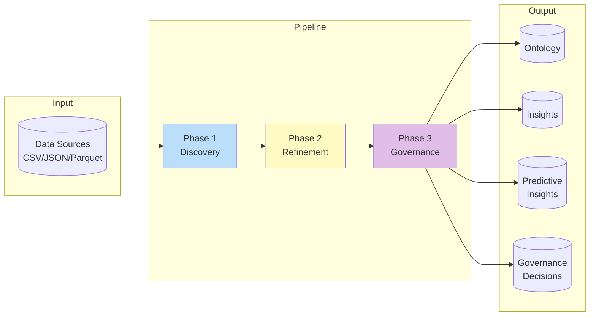
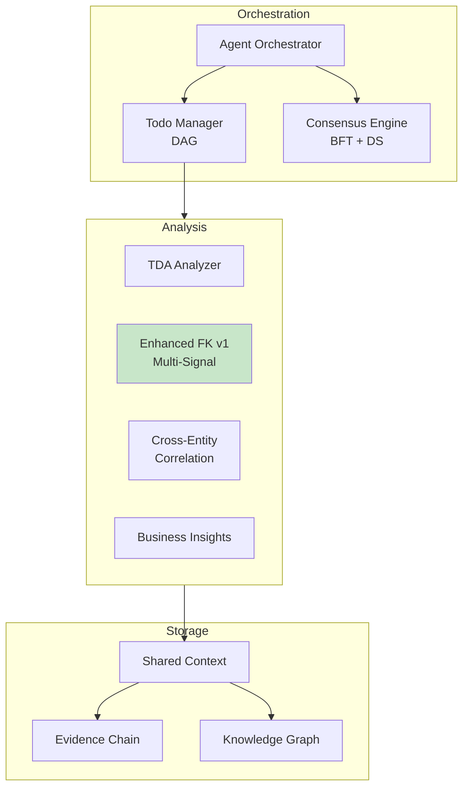
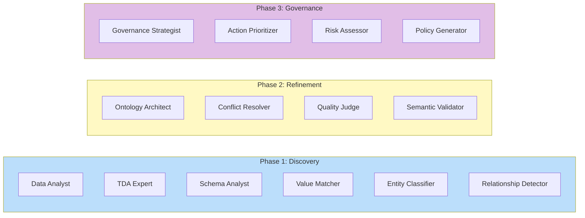
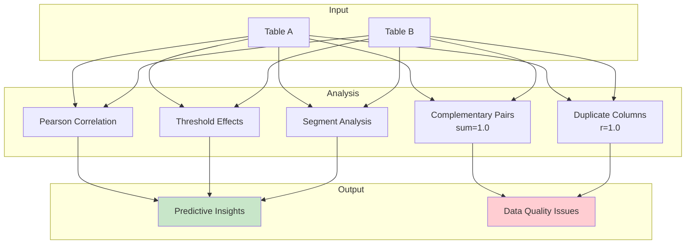
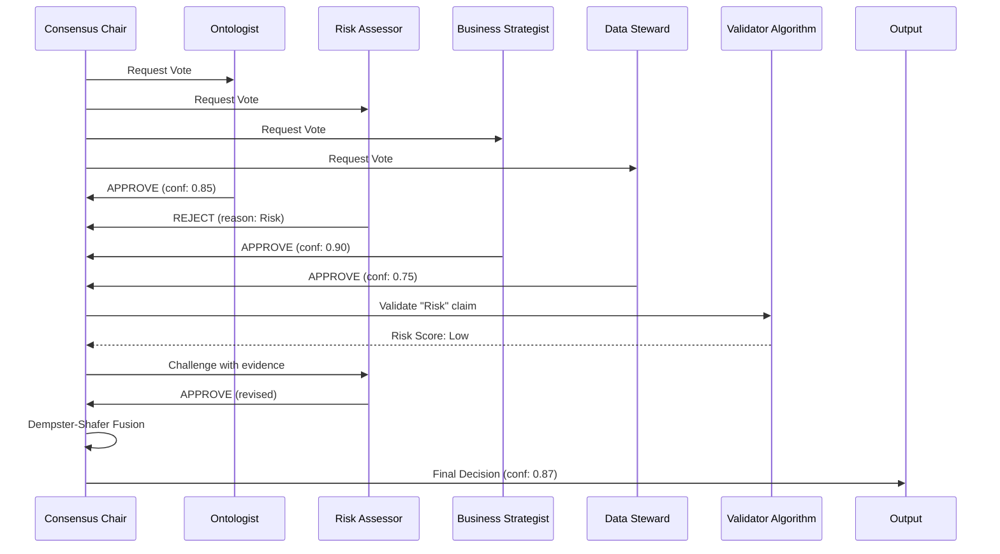
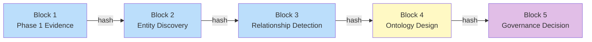
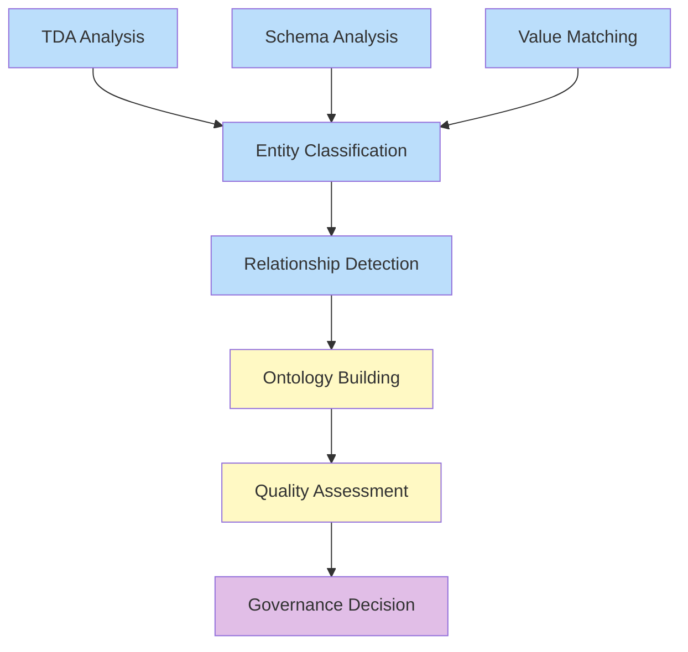
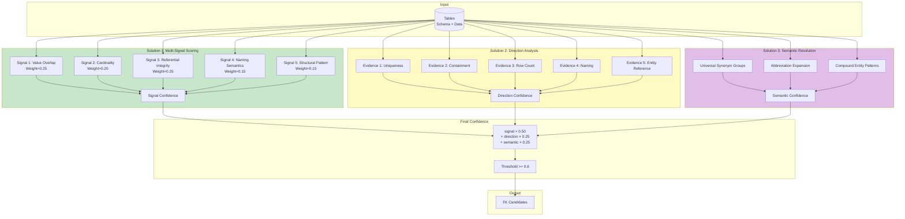
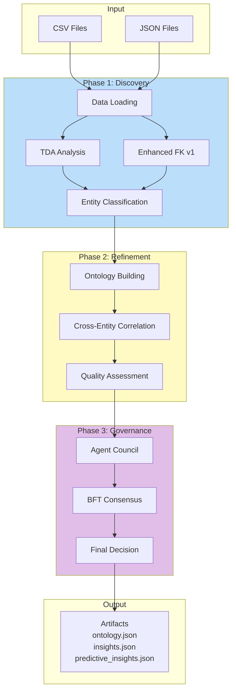

# Ontoloty v1 다이어그램

> **최종 업데이트**: 2026-01-22
> **버전**: v1

## 1. 시스템 개요



## 2. 핵심 컴포넌트



## 3. 에이전트 구성



## 4. Cross-Entity Correlation 분석



## 5. 다중 에이전트 합의 프로토콜



## 6. Evidence Chain



## 7. Todo 시스템 (DAG)



## 8. Enhanced FK Detection v1



**Cross-dataset Validation Results**:
```
┌───────────────────┬───────────┬──────────┬──────────┐
│ Dataset           │ Precision │ Recall   │ F1 Score │
├───────────────────┼───────────┼──────────┼──────────┤
│ marketing_silo    │ 100.0%    │ 100.0%   │ 100.0%   │
│ airport_silo      │ 90.9%     │ 76.9%    │ 83.3%    │
├───────────────────┼───────────┼──────────┼──────────┤
│ Cross-dataset Avg │ 95.5%     │ 88.5%    │ 91.7%    │
└───────────────────┴───────────┴──────────┴──────────┘
```

---

## 9. 데이터 흐름



## 10. 파일 구조

```
src/unified_pipeline/
├── unified_main.py              # Entry Point
├── autonomous/
│   ├── orchestrator.py          # Agent Orchestrator
│   ├── autonomous_pipeline.py   # Pipeline Orchestrator
│   ├── shared_context.py        # Shared Context
│   │
│   ├── agents/
│   │   ├── discovery.py         # Phase 1 Agents
│   │   ├── refinement.py        # Phase 2 Agents
│   │   └── governance.py        # Phase 3 Agents
│   │
│   ├── analysis/
│   │   ├── enhanced_fk_pipeline.py    # v1 Enhanced FK Pipeline
│   │   ├── fk_signal_scorer.py        # v1 Multi-Signal Scoring
│   │   ├── fk_direction_analyzer.py   # v1 Direction Analysis
│   │   ├── semantic_entity_resolver.py # v1 Semantic Resolution
│   │   ├── enhanced_fk_detector.py    # Legacy FK Detection
│   │   ├── cross_entity_correlation.py
│   │   ├── tda.py
│   │   ├── business_insights.py
│   │   └── ...
│   │
│   ├── consensus/
│   │   └── engine.py            # BFT + DS Consensus
│   │
│   └── todo/
│       ├── models.py
│       └── manager.py

output/{scenario_name}/
├── *_context.json               # Full context with relationships
├── *_entities.json              # Discovered entities
├── *_summary.json               # Execution summary
└── *_stats.json                 # Statistics
```

---

## 11. v1 검증 결과 요약

### marketing_silo (12 FK Relationships)

```
✓ leads.cust_id → customers.customer_id
✓ orders.buyer_id → customers.customer_id
✓ orders.prod_code → products.product_id
✓ email_sends.cmp_id → campaigns.campaign_id
✓ email_sends.cust_no → customers.customer_id
✓ email_events.email_send_id → email_sends.send_id
✓ ad_campaigns.marketing_campaign_ref → campaigns.campaign_id
✓ ad_performance.ad_cmp_id → ad_campaigns.ad_campaign_id
✓ web_sessions.user_id → customers.customer_id
✓ conversions.order_ref → orders.order_id
✓ conversions.attributed_ad_id → ad_campaigns.ad_campaign_id
✓ conversions.attributed_cmp_id → campaigns.campaign_id

Precision: 100% | Recall: 100% | F1: 100%
```

### airport_silo (13 FK Relationships)

```
✓ flights.carrier_code → airlines.iata_code
✓ flights.gate_number → gates.gate_code
✓ passengers.flight_num → flights.flight_number
✓ baggage.booking_reference → passengers.booking_ref
✓ baggage.flt_number → flights.flight_number
✓ maintenance.aircraft_reg → aircraft.registration_no
✗ maintenance.mechanic_id → employees.emp_id (미검출)
✓ delay_records.flt_no → flights.flight_number
... (일부 미검출)

Precision: 90.9% | Recall: 76.9% | F1: 83.3%
```

### Cross-dataset Average

```
Precision: 95.5% | Recall: 88.5% | F1: 91.7%
```
