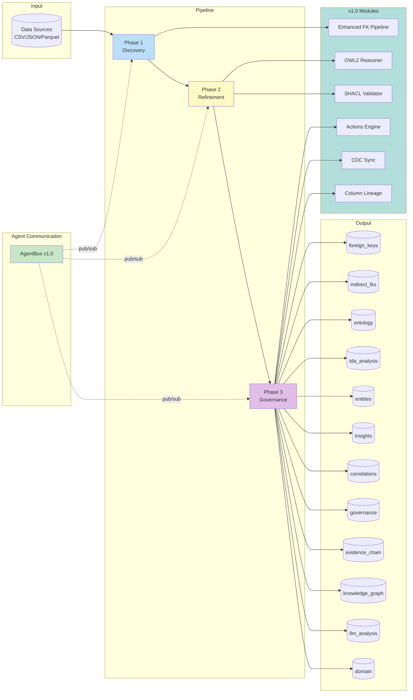
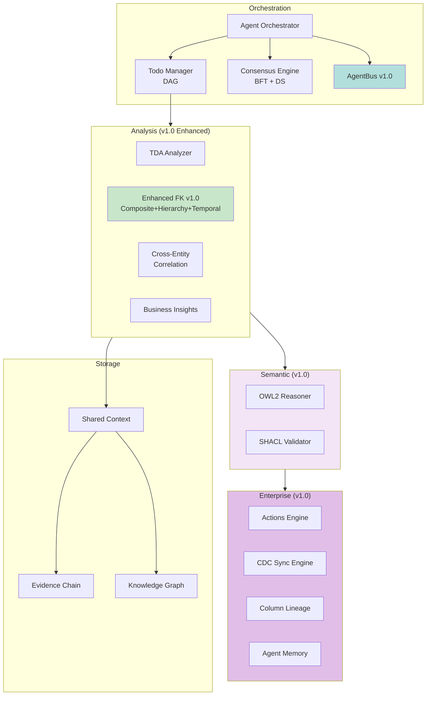
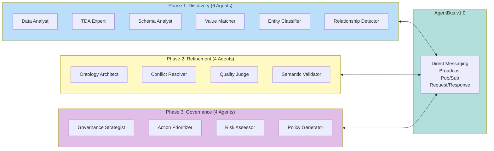
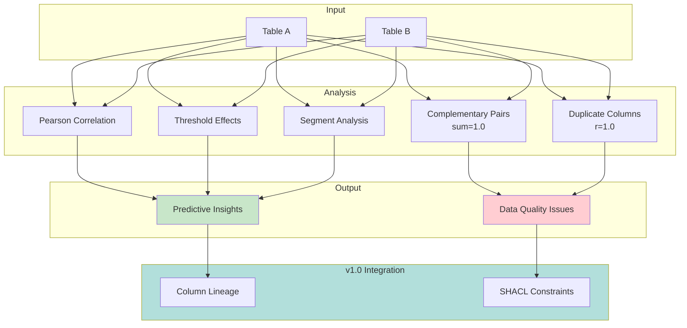
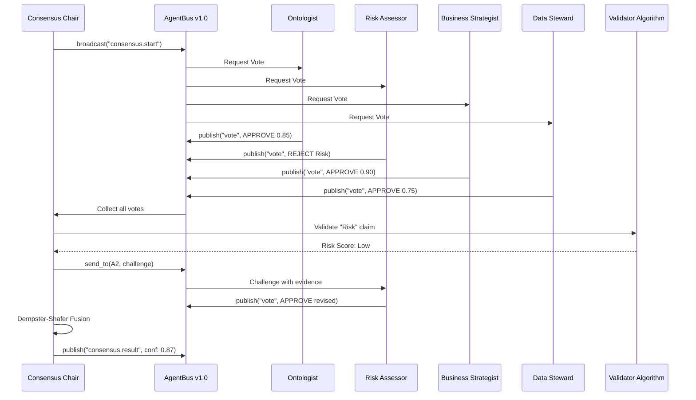
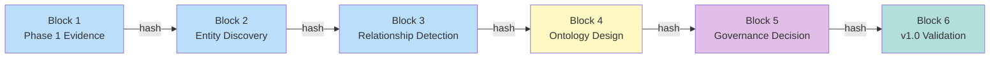
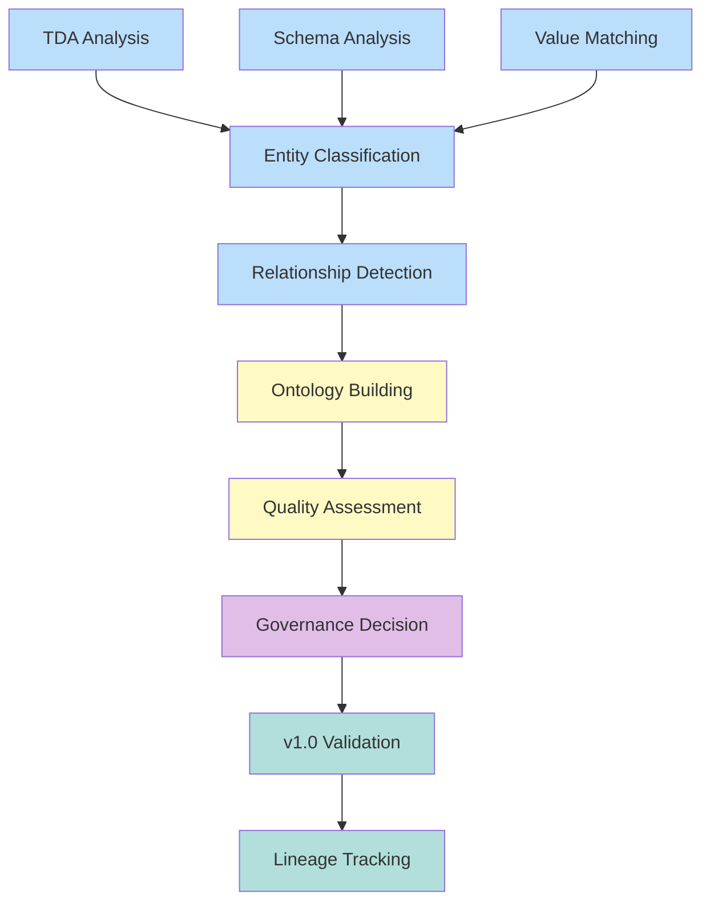
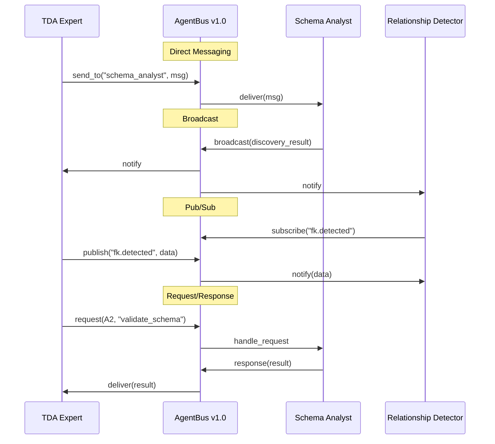
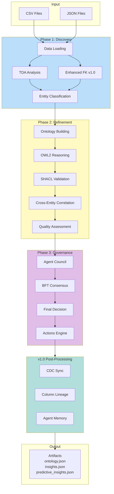

# Ontoloty v1.0 다이어그램

> **최종 업데이트**: 2026-01-27
> **버전**: v1.0

## 1. 시스템 개요



## 2. 핵심 컴포넌트



## 3. 에이전트 구성 (14 Agents)



## 4. Cross-Entity Correlation 분석



## 5. 다중 에이전트 합의 프로토콜 (v1.0)



## 6. Evidence Chain



## 7. Todo 시스템 (DAG)



## 8. Enhanced FK Detection v1.0

```mermaid
graph TD
    subgraph Input
        Tables[(Tables<br/>Schema + Data)]
    end

    subgraph Solution1["Solution 1: Multi-Signal Scoring"]
        S1[Signal 1: Value Overlap<br/>Weight=0.25]
        S2[Signal 2: Cardinality<br/>Weight=0.20]
        S3[Signal 3: Referential Integrity<br/>Weight=0.25]
        S4[Signal 4: Naming Semantics<br/>Weight=0.15]
        S5[Signal 5: Structural Pattern<br/>Weight=0.15]
        SC[Signal Confidence]
    end

    subgraph Solution2["Solution 2: Direction Analysis"]
        E1[Evidence 1: Uniqueness]
        E2[Evidence 2: Containment]
        E3[Evidence 3: Row Count]
        E4[Evidence 4: Naming]
        E5[Evidence 5: Entity Reference]
        DC[Direction Confidence]
    end

    subgraph Solution3["Solution 3: Semantic Resolution"]
        SYN[Universal Synonym Groups]
        ABB[Abbreviation Expansion]
        CMP[Compound Entity Patterns]
        SEC[Semantic Confidence]
    end

    subgraph V16_Modules["v1.0 Enhanced Detection"]
        COMP[Composite FK Detector<br/>(plant, product) → table]
        HIER[Hierarchy Detector<br/>plant → warehouse]
        TEMP[Temporal FK Detector<br/>order_date range]
    end

    subgraph FinalCalc["Final Confidence"]
        CALC[signal × 0.50<br/>+ direction × 0.25<br/>+ semantic × 0.25]
        THR[Threshold >= 0.6]
    end

    subgraph Output
        FKC[FK Candidates]
    end

    Tables --> S1 & S2 & S3 & S4 & S5
    S1 & S2 & S3 & S4 & S5 --> SC
    Tables --> E1 & E2 & E3 & E4 & E5
    E1 & E2 & E3 & E4 & E5 --> DC
    Tables --> SYN & ABB & CMP
    SYN & ABB & CMP --> SEC
    Tables --> V16_Modules
    SC & DC & SEC --> CALC --> THR --> FKC
    V16_Modules --> FKC

    style Solution1 fill:#c8e6c9
    style Solution2 fill:#fff9c4
    style Solution3 fill:#e1bee7
    style V16_Modules fill:#b2dfdb
```

**Cross-dataset Validation Results (v1.0)**:
```
┌───────────────────┬───────────┬──────────┬──────────┐
│ Dataset           │ Precision │ Recall   │ F1 Score │
├───────────────────┼───────────┼──────────┼──────────┤
│ marketing_silo    │ 100.0%    │ 100.0%   │ 100.0%   │
│ airport_silo      │ 90.9%     │ 76.9%    │ 83.3%    │
├───────────────────┼───────────┼──────────┼──────────┤
│ Cross-dataset Avg │ 95.5%     │ 88.5%    │ 91.7%    │
└───────────────────┴───────────┴──────────┴──────────┘
```

---

## 9. AgentBus v1.0 통신 패턴



---

## 10. 데이터 흐름 (v1.0)



## 11. 파일 구조 (v1.0)

```
src/unified_pipeline/
├── unified_main.py              # Entry Point
├── autonomous/
│   ├── orchestrator.py          # Agent Orchestrator
│   ├── autonomous_pipeline.py   # Pipeline Orchestrator
│   ├── shared_context.py        # Shared Context
│   ├── agent_bus.py             # v1.0: AgentCommunicationBus
│   │
│   ├── agents/
│   │   ├── discovery.py         # Phase 1 Agents (6)
│   │   ├── refinement.py        # Phase 2 Agents (4)
│   │   └── governance.py        # Phase 3 Agents (4)
│   │
│   ├── analysis/
│   │   ├── enhanced_fk_pipeline.py    # Enhanced FK Pipeline
│   │   ├── fk_signal_scorer.py        # Multi-Signal Scoring
│   │   ├── fk_direction_analyzer.py   # Direction Analysis
│   │   ├── semantic_entity_resolver.py # Semantic Resolution
│   │   ├── composite_fk_detector.py   # v1.0: Composite FK
│   │   ├── hierarchy_detector.py      # v1.0: Hierarchy
│   │   ├── temporal_fk_detector.py    # v1.0: Temporal FK
│   │   ├── cross_entity_correlation.py
│   │   ├── tda.py
│   │   ├── business_insights.py
│   │   └── ...
│   │
│   ├── consensus/
│   │   └── engine.py            # BFT + DS Consensus
│   │
│   └── todo/
│       ├── models.py
│       └── manager.py
│
│   ├── autonomous/analysis/      # v1.0: Semantic Layer (in analysis/)
│   │   ├── owl2_reasoner.py     # OWL2 Reasoning
│   │   └── shacl_validator.py   # SHACL Validation
│
├── actions/                      # v1.0: Actions Engine
│   └── actions_engine.py
│
├── sync/                         # v1.0: CDC Sync
│   └── cdc_sync_engine.py
│
├── lineage/                      # v1.0: Column Lineage
│   └── column_lineage.py
│
└── learning/                     # v1.0: Agent Learning
    └── agent_memory.py

output/{scenario_name}/
├── *_context.json               # Full context with relationships
├── *_entities.json              # Discovered entities
├── *_summary.json               # Execution summary
├── *_lineage.json               # v1.0: Column lineage
└── *_stats.json                 # Statistics
```

---

## 12. v1.0 검증 결과 요약

### marketing_silo (12 FK Relationships)

```
✓ leads.cust_id → customers.customer_id
✓ orders.buyer_id → customers.customer_id
✓ orders.prod_code → products.product_id
✓ email_sends.cmp_id → campaigns.campaign_id
✓ email_sends.cust_no → customers.customer_id
✓ email_events.email_send_id → email_sends.send_id
✓ ad_campaigns.marketing_campaign_ref → campaigns.campaign_id
✓ ad_performance.ad_cmp_id → ad_campaigns.ad_campaign_id
✓ web_sessions.user_id → customers.customer_id
✓ conversions.order_ref → orders.order_id
✓ conversions.attributed_ad_id → ad_campaigns.ad_campaign_id
✓ conversions.attributed_cmp_id → campaigns.campaign_id

Precision: 100% | Recall: 100% | F1: 100%
```

### airport_silo (13 FK Relationships)

```
✓ flights.carrier_code → airlines.iata_code
✓ flights.gate_number → gates.gate_code
✓ passengers.flight_num → flights.flight_number
✓ baggage.booking_reference → passengers.booking_ref
✓ baggage.flt_number → flights.flight_number
✓ maintenance.aircraft_reg → aircraft.registration_no
✗ maintenance.mechanic_id → employees.emp_id (미검출)
✓ delay_records.flt_no → flights.flight_number
... (일부 미검출)

Precision: 90.9% | Recall: 76.9% | F1: 83.3%
```

### Cross-dataset Average

```
Precision: 95.5% | Recall: 88.5% | F1: 91.7%
```

---

## 13. 다이어그램 파일 목록

| 파일 | 설명 | 버전 |
|------|------|------|
| [01-system-architecture.md](01-system-architecture.md) | 시스템 아키텍처 | v1.0 |
| [02-data-flow.md](02-data-flow.md) | 데이터 흐름 | v1.0 |
| [03-pipeline-workflow.md](03-pipeline-workflow.md) | 파이프라인 워크플로우 | v1.0 |
| [04-consensus-engine.md](04-consensus-engine.md) | 합의 엔진 | v1.0 |
| [05-agent-orchestration.md](05-agent-orchestration.md) | 에이전트 오케스트레이션 | v1.0 |
| [06-knowledge-graph.md](06-knowledge-graph.md) | 지식 그래프 | v1.0 |
| [07-tda-analysis.md](07-tda-analysis.md) | TDA 분석 | v1.0 |
| [08-domain-detection.md](08-domain-detection.md) | 도메인 탐지 | v1.0 |
